大数据技术之高频面试题

(作者：大数据研发部)

版本：V7.1

大数据面试题

目录 {#目录 .TOC-Heading}
====

第1章 面试说明 9

[1.1 面试过程最关键的是什么？ 9](\l)

[1.2 面试时该怎么说？ 10](\l)

[1.3 面试技巧 10](\l)

[1.3.1 六个常见问题 10](\l)

[1.3.2 两个注意事项 11](\l)

[1.3.3 自我介绍（控制在4分半以内，不超过5分钟） 11](\l)

[第2章 手写代码 11](\l)

[2.1 冒泡排序 11](\l)

[2.2 二分查找 12](\l)

[2.3 快排 14](\l)

[2.4 归并 15](\l)

[2.5 二叉树之Scala实现 16](\l)

[2.6 手写Spark-WordCount 20](\l)

[2.7 手写Spark程序 21](\l)

[第3章 项目架构 21](\l)

[3.1 数仓概念 22](\l)

[3.2 系统数据流程设计 22](\l)

[3.3 框架版本选型 22](\l)

[3.4 服务器选型 23](\l)

[3.5 集群规模 24](\l)

[3.6 人员配置参考 24](\l)

[3.6.1 整体架构 24](\l)

[3.6.2 你们部门的职级等级，晋升规则 25](\l)

[3.6.3 人员配置参考 25](\l)

[第4章 项目涉及技术 25](\l)

[4.1 Linux&Shell相关总结 25](\l)

[4.1.1 Linux常用命令 25](\l)

[4.1.2 Shell常用工具 26](\l)

[4.2 Hadoop相关总结 26](\l)

[4.2.1 Hadoop常用端口号 26](\l)

[4.2.2 Hadoop配置文件以及简单的Hadoop集群搭建 26](\l)

[4.2.3 HDFS读流程和写流程 27](\l)

[4.2.4
MapReduce的Shuffle过程及Hadoop优化（包括：压缩、小文件、集群优化）
28](\l)

[4.2.5 Yarn的Job提交流程 31](\l)

[4.2.6 Yarn的默认调度器、调度器分类、以及他们之间的区别 31](\l)

[4.2.7 项目经验之LZO压缩 33](\l)

[4.2.8 Hadoop参数调优 33](\l)

[4.2.9 项目经验之基准测试 34](\l)

[4.2.10 Hadoop宕机 34](\l)

[4.3 Zookeeper相关总结 34](\l)

[4.3.1 选举机制 34](\l)

[4.3.2 常用命令 34](\l)

[4.4 Flume相关总结 34](\l)

[4.4.1 Flume组成，Put事务，Take事务 34](\l)

[4.4.2 Flume拦截器 35](\l)

[4.4.3 Flume Channel选择器 35](\l)

[4.4.4 Flume监控器 36](\l)

[4.4.5 Flume采集数据会丢失吗?（防止数据丢失的机制） 36](\l)

[4.4.6 Flume内存 36](\l)

[4.4.7 FileChannel优化 36](\l)

[4.4.8 HDFS Sink小文件处理 36](\l)

[4.5 Kafka相关总结 37](\l)

[4.5.1 Kafka架构 37](\l)

[4.5.2 Kafka压测 37](\l)

[4.5.3 Kafka的机器数量 37](\l)

[4.5.4 Kafka的日志保存时间 37](\l)

[4.5.5 Kafka的硬盘大小 37](\l)

[4.5.6 Kafka监控 38](\l)

[4.5.7 Kakfa分区数 38](\l)

[4.5.8 副本数设定 38](\l)

[4.5.9 多少个Topic 38](\l)

[4.5.10 Kafka丢不丢数据 38](\l)

[4.5.11 Kafka的ISR副本同步队列 38](\l)

[4.5.12 Kafka分区分配策略 38](\l)

[4.5.13 Kafka中数据量计算 39](\l)

[4.5.14 Kafka挂掉 39](\l)

[4.5.15 Kafka消息数据积压，Kafka消费能力不足怎么处理？ 39](\l)

[4.5.16 Kafka幂等性 39](\l)

[4.5.17 Kafka事务 40](\l)

[4.5.18 Kafka数据重复 40](\l)

[4.5.19 Kafka参数优化 40](\l)

[4.6 Hive总结 42](\l)

[4.6.1 Hive的架构 42](\l)

[4.6.2 Hive和数据库比较 42](\l)

[4.6.3 内部表和外部表 42](\l)

[4.6.4 4个By区别 42](\l)

[4.6.5 窗口函数 43](\l)

[4.6.6 自定义UDF、UDTF 43](\l)

[4.6.7 Hive优化 44](\l)

[4.7 HBase总结 45](\l)

[4.7.1 HBase存储结构 45](\l)

[4.7.2 rowkey设计原则 47](\l)

[4.7.3 RowKey如何设计 47](\l)

[4.7.4 Phoenix二级索引（讲原理） 47](\l)

[4.8 Sqoop参数 47](\l)

[4.8.1 Sqoop导入导出Null存储一致性问题 47](\l)

[4.8.2 Sqoop数据导出一致性问题 47](\l)

[4.8.3 Sqoop底层运行的任务是什么 48](\l)

[4.8.4 Sqoop数据导出的时候一次执行多长时间 48](\l)

[4.9 Scala 48](\l)

[4.9.1 开发环境 48](\l)

[4.9.2 变量和数据类型 48](\l)

[4.9.3 流程控制 48](\l)

[4.9.4 函数式编程 48](\l)

[4.9.5 面向对象 48](\l)

[4.9.6 集合 49](\l)

[4.9.7 模式匹配 49](\l)

[4.9.8 异常 49](\l)

[4.9.9 隐式转换 49](\l)

[4.9.10 泛型 49](\l)

[4.10 Spark 49](\l)

[4.10.1 Spark有几种部署方式？请分别简要论述 49](\l)

[4.10.2 Spark任务使用什么进行提交，JavaEE界面还是脚本 49](\l)

[4.10.3 Spark提交作业参数（重点） 49](\l)

[4.10.4
简述Spark的架构与作业提交流程（画图讲解，注明各个部分的作用）（重点）
50](\l)

[4.10.5 如何理解Spark中的血统概念（RDD）（笔试重点） 51](\l)

[4.10.6
简述Spark的宽窄依赖，以及Spark如何划分stage，每个stage又根据什么决定task个数?
（笔试重点） 51](\l)

[4.10.7 请列举Spark的transformation算子（不少于8个），并简述功能（重点）
52](\l)

[4.10.8 请列举Spark的action算子（不少于6个），并简述功能（重点） 53](\l)

[4.10.9 请列举会引起Shuffle过程的Spark算子，并简述功能。 53](\l)

[4.10.10
简述Spark的两种核心Shuffle（HashShuffle与SortShuffle）的工作流程（包括未优化的HashShuffle、优化的HashShuffle、普通的SortShuffle与bypass的SortShuffle）（重点）
53](\l)

[4.10.11
Spark常用算子reduceByKey与groupByKey的区别，哪一种更具优势？（重点）
56](\l)

[4.10.12 Repartition和Coalesce关系与区别 56](\l)

[4.10.13
分别简述Spark中的缓存机制（cache和persist）与checkpoint机制，并指出两者的区别与联系
57](\l)

[4.10.14
简述Spark中共享变量（广播变量和累加器）的基本原理与用途。（重点）
57](\l)

[4.10.15
当Spark涉及到数据库的操作时，如何减少Spark运行中的数据库连接数？ 57](\l)

[4.10.16 简述SparkSQL中RDD、DataFrame、DataSet三者的区别与联系?
（笔试重点） 57](\l)

[4.10.17 SparkSQL中join操作与left join操作的区别？ 58](\l)

[4.10.18
SparkStreaming有哪几种方式消费Kafka中的数据，它们之间的区别是什么？
59](\l)

[4.10.19 简述SparkStreaming窗口函数的原理（重点） 60](\l)

[4.10.20 请手写出WordCount的Spark代码实现（Scala）（手写代码重点）
60](\l)

[4.10.21 如何使用Spark实现TopN的获取（描述思路或使用伪代码）（重点）
61](\l)

[4.10.22
京东：调优之前与调优之后性能的详细对比（例如调整map个数，map个数之前多少、之后多少，有什么提升）
61](\l)

[4.11 Spark Sql、DataFrames、DataSet 61](\l)

[4.11.1 append和overwrite的区别 61](\l)

[4.11.2 coalesce和repartition的区别 61](\l)

[4.11.3 cache缓存级别 62](\l)

[4.11.4 释放缓存和缓存 62](\l)

[4.11.4 Spark Shuffle默认并行度 62](\l)

[4.11.5 kryo序列化 62](\l)

[4.11.6 创建临时表和全局临时表 62](\l)

[4.11.7 BroadCast join 广播join 62](\l)

[4.11.7 控制Spark reduce缓存 调优shuffle 62](\l)

[4.11.7 注册UDF函数 62](\l)

[4.12 Spark Streaming 63](\l)

[4.12.1 Spark Streaming第一次运行不丢失数据 63](\l)

[4.12.2 Spark Streaming精准一次消费 63](\l)

[4.12.3 Spark Streaming控制每秒消费数据的速度 63](\l)

[4.12.4 Spark Streaming背压机制 63](\l)

[4.12.5 Spark Streaming 一个stage耗时 63](\l)

[4.12.6 Spark Streaming 优雅关闭 63](\l)

[4.12.6 Spark Streaming 默认分区个数 63](\l)

[4.13 元数据管理（Atlas血缘系统） 63](\l)

[4.14 数据质量监控（Griffin） 63](\l)

[第5章 用户行为数据分析 64](\l)

[5.1 数仓分层架构表 64](\l)

[5.2 埋点行为数据基本格式(基本字段) 64](\l)

[5.3 项目经验总结 66](\l)

[5.3.1 项目经验之元数据备份 66](\l)

[5.3.2 日期处理函数 66](\l)

[5.3.3 Union与Union all区别 66](\l)

[5.3.4 Shell中单引号和双引号区别 66](\l)

[5.3.5 Tez引擎优点？ 67](\l)

[5.4 ods层 67](\l)

[5.5 dwd层 67](\l)

[5.5.1 自定义UDF/UDTF（项目中的应用） 67](\l)

[5.5.2 事件日志基础明细表 68](\l)

[5.5.3 商品点击表 68](\l)

[5.5.4 其他的具体事件明细表 68](\l)

[5.6 需求一：用户活跃主题 69](\l)

[5.6.1 DWS层日活明细表 69](\l)

[5.6.2 DWS层周活明细表 69](\l)

[5.6.3 DWS层月活明细表 70](\l)

[5.6.4 ADS层日周月活跃设备数表 70](\l)

[5.7 需求二：用户新增主题 71](\l)

[5.7.1 DWS层日新增明细表 71](\l)

[5.7.2 ADS层每日新增设备数表 72](\l)

[5.8 需求三：用户留存主题 72](\l)

[5.8.1 DWS层日留存明细表 73](\l)

[5.8.2 ADS层留存用户数表 74](\l)

[5.8.3 ADS层留存用户率表 74](\l)

[5.9 需求四：沉默用户 75](\l)

[5.10 需求五：本周回流用户数 75](\l)

[5.11 需求六：流失用户数 76](\l)

[5.12 需求七：最近连续3周活跃用户数 76](\l)

[5.13 需求八：最近七天内连续三天活跃用户数 77](\l)

[5.14 需求逻辑 77](\l)

[5.14.1 如何分析用户活跃？ 77](\l)

[5.14.2 如何分析用户新增？ 77](\l)

[5.14.3 如何分析用户1天留存？ 77](\l)

[5.14.4 如何分析沉默用户？ 77](\l)

[5.14.5 如何分析本周回流用户？ 77](\l)

[5.14.6 如何分析流失用户？ 77](\l)

[5.14.7 如何分析最近连续3周活跃用户数？ 78](\l)

[5.14.8 如何分析最近七天内连续三天活跃用户数？ 78](\l)

[第6章 业务交互数据分析 78](\l)

[6.1 电商常识 78](\l)

[6.2 电商业务流程 78](\l)

[6.3 业务表关键字段 78](\l)

[6.3.1 订单表（order\_info） 78](\l)

[6.3.2 订单详情表（order\_detail） 79](\l)

[6.3.3 商品表 79](\l)

[6.3.4 用户表 79](\l)

[6.3.5 商品一级分类表 80](\l)

[6.3.6 商品二级分类表 80](\l)

[6.3.7 商品三级分类表 80](\l)

[6.3.8 支付流水表 80](\l)

[6.4 MySql中表的分类 81](\l)

[6.5 同步策略 81](\l)

[6.6 关系型数据库范式理论 82](\l)

[6.7 数据模型 82](\l)

[6.8 业务数据数仓搭建 82](\l)

[6.8.1 ods层 83](\l)

[6.8.2 dwd层 83](\l)

[6.8.3 dws层 84](\l)

[6.9 需求一：GMV成交总额 84](\l)

[6.10 需求二：转化率 85](\l)

[6.10.1 新增用户占日活跃用户比率表 85](\l)

[6.10.2 用户行为转化率表 85](\l)

[6.11 需求三：品牌复购率 86](\l)

[6.11.1 用户购买商品明细表（宽表） 86](\l)

[6.11.2 品牌复购率表 86](\l)

[6.12 项目中有多少张宽表 87](\l)

[6.13 拉链表 87](\l)

[第7章 即席查询数据仓库 89](\l)

[第8章 项目开发经验 89](\l)

[8.1 项目开发中遇到哪些问题 89](\l)

[8.1.1 Hadoop 89](\l)

[8.1.2 Flume 90](\l)

[8.1.3 Kafka 90](\l)

[8.1.4 Hive 91](\l)

[8.1.5 MySql 91](\l)

[8.1.6 Tez引擎优点？ 92](\l)

[8.1.7 Sqoop 92](\l)

[8.1.8 Azkaban 93](\l)

[8.1.9 Spark 93](\l)

[8.2 业务经验 94](\l)

[8.2.1 ODS层采用什么压缩方式和存储格式？ 94](\l)

[8.2.2 DWD层做了哪些事？ 94](\l)

[8.2.3 DWS层做了哪些事？ 95](\l)

[8.2.4 分析过哪些指标（一分钟至少说出30个指标） 97](\l)

[8.2.5 分析过最难的两个指标，现场手写 100](\l)

[8.2.6 数据仓库每天跑多少张表，大概什么时候运行，运行多久？ 100](\l)

[8.2.7 数仓中使用的哪种文件存储格式 101](\l)

[8.2.8 数仓中用到过哪些Shell脚本及具体功能 101](\l)

[8.2.9 项目中用过的报表工具 101](\l)

[8.2.10 测试相关 101](\l)

[8.2.11 项目实际工作流程 101](\l)

[8.2.12 项目中实现一个需求大概多长时间 103](\l)

[8.2.13 项目在3年内迭代次数，每一个项目具体是如何迭代的。 103](\l)

[8.2.14 项目开发中每天做什么事 104](\l)

[第9章 电商运营经验 104](\l)

[9.1 电商指标整理 104](\l)

[9.2 电商8类基本指标 105](\l)

[9.3 五大关键电商指标和三个思路 108](\l)

[9.4 电商运营数据挖掘 114](\l)

[9.5 直播指标 119](\l)

[第10章 JavaSE（答案精简） 123](\l)

[10.1 HashMap底层源码，数据结构 123](\l)

[10.2 Java自带哪几种线程池？ 126](\l)

[10.3 HashMap和HashTable区别 127](\l)

[10.4 TreeSet和HashSet区别 128](\l)

[10.5 String buffer和String build区别 128](\l)

[10.6 Final、Finally、Finalize 128](\l)

[10.7 ==和Equals区别 129](\l)

[第11章 Redis（答案精简） 129](\l)

[11.1 缓存穿透、缓存雪崩、缓存击穿 129](\l)

[11.2 哨兵模式 130](\l)

[11.3 数据类型 130](\l)

[11.4 持久化 130](\l)

[11.5 悲观锁 131](\l)

[11.6 乐观锁 131](\l)

[第12章 MySql 131](\l)

[12.1 MyISAM与InnoDB的区别 131](\l)

[12.2 索引 131](\l)

[12.3 b-tree和b+tree的区别 132](\l)

[12.4 redis是单线程的，为什么那么快 132](\l)

[12.5 MySQL的事务 132](\l)

[第13章 JVM 134](\l)

[13.1 JVM内存分哪几个区，每个区的作用是什么? 134](\l)

[13.2 Java类加载过程? 135](\l)

[13.3 java中垃圾收集的方法有哪些? 136](\l)

[13.4 如何判断一个对象是否存活?(或者GC对象的判定方法) 136](\l)

[13.5 什么是类加载器，类加载器有哪些? 137](\l)

[13.6 简述Java内存分配与回收策略以及Minor GC和Major GC（full GC）
137](\l)

[第14章 JUC 138](\l)

[**14.1 Synchronized与Lock的区别** 138](\l)

[**14.2 Runnable和Callable的区别** 138](\l)

[**14.3 什么是分布式锁** 138](\l)

[**14.4 什么是分布式事务** 138](\l)

[第15章 手写HQL 138](\l)

[15.1 手写HQL 第1题 138](\l)

[15.2 手写HQL 第2题 138](\l)

[15.3 手写HQL 第3题 139](\l)

[15.4 手写HQL 第4题 139](\l)

[15.5 手写HQL 第5题 139](\l)

[15.6 手写HQL 第6题 140](\l)

[15.7 手写HQL 第7题 140](\l)

[15.8 手写HQL 第8题 140](\l)

[15.9 手写HQL 第9题 140](\l)

[15.10 手写HQL 第10题 141](\l)

[15.11 手写HQL 第11题 141](\l)

[15.12 手写HQL 第12题 142](\l)

第1章 面试说明
==============

1.1 面试过程最关键的是什么？
----------------------------

1）大大方方的聊，放松

2）体现优势，避免劣势

1.2 面试时该怎么说？
--------------------

1）语言表达清楚

（1）思维逻辑清晰，表达流畅

（2）一二三层次表达

2）所述内容不犯错

（1）不说前东家或者自己的坏话

（2）往自己擅长的方面说

（3）实质，对考官来说，内容听过，就是自我肯定；没听过，那就是个学习的过程。

1.3 面试技巧
------------

### 1.3.1 六个常见问题

1）你的优点是什么？

大胆的说出自己各个方面的优势和特长

2）你的缺点是什么？

不要谈自己真实问题；用"缺点"衬托自己的优点

3）你的离职原因是什么？

-   不说前东家坏话，哪怕被伤过

-   合情合理合法

-   不要说超过1个以上的原因

4）您对薪资的期望是多少？

-   非终面不深谈薪资

-   只说区间，不说具体数字

-   底线是不低于当前薪资

-   非要具体数字，区间取中间值，或者当前薪资的+20%

5）您还有什么想问的问题？

-   这是体现个人眼界和层次的问题

-   问题本身不在于面试官想得到什么样的答案，而在于你跟别的应聘者的对比

-   标准答案：

> 公司希望我入职后的3-6个月内，给公司解决什么样的问题
>
> 公司（或者对这个部门）未来的战略规划是什么样子的？
>
> 以你现在对我的了解，您觉得我需要多长时间融入公司？

6）您最快多长时间能入职？

一周左右，如果公司需要，可以适当提前。

### 1.3.2 两个注意事项

1）职业化的语言

2）职业化的形象

### 1.3.3 自我介绍（控制在4分半以内，不超过5分钟）

1）个人基本信息

2）工作履历

时间、公司名称、任职岗位、主要工作内容、工作业绩、离职原因

3）深度沟通（也叫压力面试）

刨根问底下沉式追问（注意是下沉式，而不是发散式的）

基本技巧：往自己熟悉的方向说

第2章 手写代码
==============

2.1 冒泡排序
------------

/\*\*

\* 冒泡排序 时间复杂度 O(n\^2) 空间复杂度O(1)

\*/

public class BubbleSort {

public static void bubbleSort(int\[\] data) {

System.out.println(\"开始排序\");

int arrayLength = data.length;

for (int i = 0; i \< arrayLength - 1; i++) {

boolean flag = false;

for (int j = 0; j \< arrayLength - 1 - i; j++) {

if(data\[j\] \> data\[j + 1\]){

int temp = data\[j + 1\];

data\[j + 1\] = data\[j\];

data\[j\] = temp;

flag = true;

}

}

System.out.println(java.util.Arrays.toString(data));

if (!flag)

break;

}

}

public static void main(String\[\] args) {

int\[\] data = { 9, -16, 21, 23, -30, -49, 21, 30, 30 };

System.out.println(\"排序之前：\\n\" + java.util.Arrays.toString(data));

bubbleSort(data);

System.out.println(\"排序之后：\\n\" + java.util.Arrays.toString(data));

}

}

2.2 二分查找
------------

{width="5.545138888888889in"
height="3.122916666666667in"}

图4-二分查找核心思路

实现代码：

/\*\*

\* 二分查找 时间复杂度O(log2n);空间复杂度O(1)

\*/

def binarySearch(arr:Array\[Int\],left:Int,right:Int,findVal:Int):
Int={\
if(left\>right){//递归退出条件，找不到，返回-1\
-1\
}\
\
val midIndex = (left+right)/2\
\
if (findVal \< arr(midIndex)){//向左递归查找\
binarySearch(arr,left,midIndex,findVal)\
}else if(findVal \> arr(midIndex)){//向右递归查找\
binarySearch(arr,midIndex,right,findVal)\
}else{//查找到，返回下标\
midIndex\
}\
}

拓展需求：当一个有序数组中，有多个相同的数值时，如何将所有的数值都查找到。

代码实现如下：

/\*

{1,8, 10, 89, 1000, 1000，1234}
当一个有序数组中，有多个相同的数值时，如何将所有的数值都查找到，比如这里的
1000.

//分析

1\. 返回的结果是一个可变数组 ArrayBuffer

2\. 在找到结果时，向左边扫描，向右边扫描 \[条件\]

3\. 找到结果后，就加入到ArrayBuffer

\*/

def binarySearch2(arr: Array\[Int\], l: Int, r: Int,

findVal: Int): ArrayBuffer\[Int\] = {

//找不到条件?

if (l \> r) {

return ArrayBuffer()

}

val midIndex = (l + r) / 2

val midVal = arr(midIndex)

if (midVal \> findVal) {

//向左进行递归查找

binarySearch2(arr, l, midIndex - 1, findVal)

} else if (midVal \< findVal) { //向右进行递归查找

binarySearch2(arr, midIndex + 1, r, findVal)

} else {

println(\"midIndex=\" + midIndex)

//定义一个可变数组

val resArr = ArrayBuffer\[Int\]()

//向左边扫描

var temp = midIndex - 1

breakable {

while (true) {

if (temp \< 0 \|\| arr(temp) != findVal) {

break()

}

if (arr(temp) == findVal) {

resArr.append(temp)

}

temp -= 1

}

}

//将中间这个索引加入

resArr.append(midIndex)

//向右边扫描

temp = midIndex + 1

breakable {

while (true) {

if (temp \> arr.length - 1 \|\| arr(temp) != findVal) {

break()

}

if (arr(temp) == findVal) {

resArr.append(temp)

}

temp += 1

}

}

return resArr

}

2.3 快排
--------

{width="5.759722222222222in"
height="3.220833333333333in"}图1-快速排序核心思想

代码实现：

/\*\*

\* 快排

\* 时间复杂度:平均时间复杂度为O(nlogn)

\* 空间复杂度:O(logn)，因为递归栈空间的使用问题

\*/

def quickSort(list: List\[Int\]): List\[Int\] = list match {

case Nil =\> Nil

case List() =\> List()

case head :: tail =\>

val (left, right) = tail.partition(\_ \< head)

quickSort(left) ::: head :: quickSort(right)

}

2.4 归并
--------

{width="5.759722222222222in"
height="3.220833333333333in"}

图2-归并排序核心思想

核心思想：不断的将大的数组分成两个小数组，直到不能拆分为止，即形成了单个值。此时使用合并的排序思想对已经有序的数组进行合并，合并为一个大的数据，不断重复此过程，直到最终所有数据合并到一个数组为止。

{width="5.4743055555555555in"
height="3.058333333333333in"}

图3-归并排序"治"流程

代码实现：

/\*\*

\* 快排

\* 时间复杂度:O(nlogn)

\* 空间复杂度:O(n)

\*/

def merge(left: List\[Int\], right: List\[Int\]): List\[Int\] = (left,
right) match {

case (Nil, \_) =\> right

case (\_, Nil) =\> left

case (x :: xTail, y :: yTail) =\>

if (x \<= y) x :: merge(xTail, right)

else y :: merge(left, yTail)

}

2.5 二叉树之Scala实现
---------------------

1）二叉树概念

{width="5.5in" height="3.0972222222222223in"}

2）二叉树的特点

（1）树执行查找、删除、插入的时间复杂度都是O(logN)

（2）遍历二叉树的方法包括前序、中序、后序

（3）非平衡树指的是根的左右两边的子节点的数量不一致

（4）在非空二叉树中，第i层的结点总数不超过 , i\>=1；

（5）深度为h的二叉树最多有个结点(h\>=1)，最少有h个结点；

（6）对于任意一棵二叉树，如果其叶结点数为N0，而度数为2的结点总数为N2，则N0=N2+1；

3） 二叉树的Scala代码实现

定义节点以及前序、中序、后序遍历

class TreeNode(treeNo:Int){

val no = treeNo

var left:TreeNode = null

var right:TreeNode = null

//后序遍历

def postOrder():Unit={

//向左递归输出左子树

if(this.left != null){

this.left.postOrder

}

//向右递归输出右子树

if (this.right != null) {

this.right.postOrder

}

//输出当前节点值

printf(\"节点信息 no=%d \\n\",no)

}

//中序遍历

def infixOrder():Unit={

//向左递归输出左子树

if(this.left != null){

this.left.infixOrder()

}

//输出当前节点值

printf(\"节点信息 no=%d \\n\",no)

//向右递归输出右子树

if (this.right != null) {

this.right.infixOrder()

}

}

//前序遍历

def preOrder():Unit={

//输出当前节点值

printf(\"节点信息 no=%d \\n\",no)

//向左递归输出左子树

if(this.left != null){

this.left.postOrder()

}

//向右递归输出右子树

if (this.right != null) {

this.right.preOrder()

}

}

//后序遍历查找

def postOrderSearch(no:Int): TreeNode = {

//向左递归输出左子树

var resNode:TreeNode = null

if (this.left != null) {

resNode = this.left.postOrderSearch(no)

}

if (resNode != null) {

return resNode

}

if (this.right != null) {

resNode = this.right.postOrderSearch(no)

}

if (resNode != null) {

return resNode

}

println(\"ttt\~\~\")

if (this.no == no) {

return this

}

resNode

}

//中序遍历查找

def infixOrderSearch(no:Int): TreeNode = {

var resNode : TreeNode = null

//先向左递归查找

if (this.left != null) {

resNode = this.left.infixOrderSearch(no)

}

if (resNode != null) {

return resNode

}

println(\"yyy\~\~\")

if (no == this.no) {

return this

}

//向右递归查找

if (this.right != null) {

resNode = this.right.infixOrderSearch(no)

}

return resNode

}

//前序查找

def preOrderSearch(no:Int): TreeNode = {

if (no == this.no) {

return this

}

//向左递归查找

var resNode : TreeNode = null

if (this.left != null) {

resNode = this.left.preOrderSearch(no)

}

if (resNode != null){

return resNode

}

//向右边递归查找

if (this.right != null) {

resNode = this.right.preOrderSearch(no)

}

return resNode

}

//删除节点

//删除节点规则

//1如果删除的节点是叶子节点，则删除该节点

//2如果删除的节点是非叶子节点，则删除该子树

def delNode(no:Int): Unit = {

//首先比较当前节点的左子节点是否为要删除的节点

if (this.left != null && this.left.no == no) {

this.left = null

return

}

//比较当前节点的右子节点是否为要删除的节点

if (this.right != null && this.right.no == no) {

this.right = null

return

}

//向左递归删除

if (this.left != null) {

this.left.delNode(no)

}

//向右递归删除

if (this.right != null) {

this.right.delNode(no)

}

}

}

定义二叉树，前序、中序、后序遍历，前序、中序、后序查找，删除节点

class BinaryTree{

var root:TreeNode = null

//后序遍历

def postOrder(): Unit = {

if (root != null){

root.postOrder()

}else {

println(\"当前二叉树为空，不能遍历\")

}

}

//中序遍历

def infixOrder(): Unit = {

if (root != null){

root.infixOrder()

}else {

println(\"当前二叉树为空，不能遍历\")

}

}

//前序遍历

def preOrder(): Unit = {

if (root != null){

root.preOrder()

}else {

println(\"当前二叉树为空，不能遍历\")

}

}

//后序遍历查找

def postOrderSearch(no:Int): TreeNode = {

if (root != null) {

root.postOrderSearch(no)

}else{

null

}

}

//中序遍历查找

def infixOrderSeacher(no:Int): TreeNode = {

if (root != null) {

return root.infixOrderSearch(no)

}else {

return null

}

}

//前序查找

def preOrderSearch(no:Int): TreeNode = {

if (root != null) {

return root.preOrderSearch(no)

}else{

//println(\"当前二叉树为空，不能查找\")

return null

}

}

//删除节点

def delNode(no:Int): Unit = {

if (root != null) {

//先处理一下root是不是要删除的

if (root.no == no){

root = null

}else {

root.delNode(no)

}

}

}

2.6 手写Spark-WordCount
-----------------------

val conf: SparkConf =

new SparkConf().setMaster(\"local\[\*\]\").setAppName(\"WordCount\")

val sc = new SparkContext(conf)

sc.textFile(\"/input\")

.flatMap(\_.split(\" \"))

.map((\_, 1))

.reduceByKey(\_ + \_)

.saveAsTextFile(\"/output\")

sc.stop()

2.7 手写Spark程序
-----------------

要求：(a,1) (a,3) (b,3) (b,5) (c,4)，求每个key对应value的平均值

rdd.combineByKey(v=\>(v,1),(acc:(Int,Int),newV)=\>(acc.\_1+newV,acc.\_2+1),(acc1:(Int,Int),acc2:(Int,Int))=\>(acc1.\_1+acc2.\_1,acc1.\_2+acc2.\_2))

第3章 项目架构
==============

云上数据仓库解决方案：<https://www.aliyun.com/solution/datavexpo/datawarehouse>

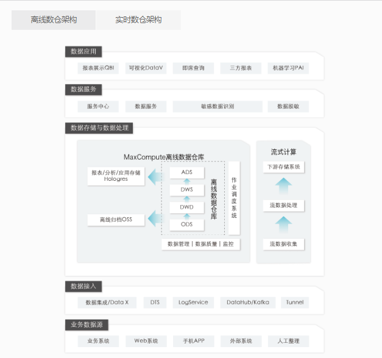{width="3.884027777777778in" height="4.625in"}

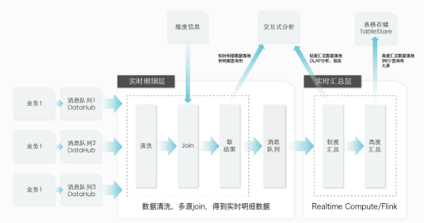{width="5.345138888888889in"
height="2.6993055555555556in"}

3.1 数仓概念
------------

**数据仓库的输入数据源和输出系统分别是什么？**

输入系统：埋点产生的用户行为数据、JavaEE后台产生的业务数据、个别公司有爬虫数据。

输出系统：报表系统、用户画像系统、推荐系统

3.2 系统数据流程设计
--------------------

{width="5.701388888888889in"
height="3.201388888888889in"}

3.3 框架版本选型
----------------

1）Apache：运维麻烦，组件间兼容性需要自己调研。（一般大厂使用，技术实力雄厚，有专业的运维人员）

2）CDH：国内使用最多的版本，但
CM不开源，但其实对中、小公司使用来说没有影响（建议使用）

3）HDP：开源，可以进行二次开发，但是没有CDH稳定，国内使用较少

{width="5.701388888888889in"
height="3.201388888888889in"}

3.4 服务器选型
--------------

服务器使用物理机还是云主机？

1）机器成本考虑：

（1）物理机：以128G内存，20核物理CPU，40线程，8THDD和2TSSD硬盘，单台报价4W出头，惠普品牌。需考虑托管服务器费用。一般物理机寿命5年左右。

（2）云主机，以阿里云为例，差不多相同配置，每年5W

2）运维成本考虑：

（1）物理机：需要有专业的运维人员

（2）云主机：很多运维工作都由阿里云已经完成，运维相对较轻松

3.5 集群规模
------------

{width="5.701388888888889in"
height="3.201388888888889in"}

根据数据规模大家集群

  ------- ------- ------- ------- ------- ------- ------- ------- ------- -------
  1       2       3       4       5       6       7       8       9       10
  nn      nn      dn      dn      dn      dn      dn      dn      dn      dn
                  rm      rm      nm      nm      nm      nm      nm      nm
                  nm      nm                                              
                                                          zk      zk      zk
                                                          kafka   kafka   kafka
                                                          Flume   Flume   flume
                                          flume   flume                   
                  Hbase   Hbase   Hbase                                   
  hive    hive                                                            
  mysql   mysql                                                           
  spark   spark   spark   spark   spark   spark   spark   spark   spark   spark
                                          ES      ES                      
  ------- ------- ------- ------- ------- ------- ------- ------- ------- -------

3.6 人员配置参考
----------------

### 3.6.1 整体架构

属于研发部，技术总监下面有各个项目组，我们属于大数据组，其他还有后端项目组，前端组、测试组等。总监上面就是副总等级别了。其他的还有产品运营部等。

### 3.6.2 你们部门的职级等级，晋升规则

职级就分初级，中级，高级。晋升规则不一定，看公司效益和职位空缺。

京东：T1、T2应届生；T3 14k左右 T4 18K左右 T5 24k-28k左右

阿里：p5、p6、p7、p8

### 3.6.3 人员配置参考

小型公司（3人左右）：组长1人，剩余组员无明确分工，并且可能兼顾javaEE和前端。

中小型公司（3\~6人左右）：组长1人，离线2人左右，实时1人左右（离线一般多于实时），组长兼顾和javaEE、前端。

中型公司（5\~10人左右）：组长1人，离线3\~5人左右（离线处理、数仓），实时2人左右，组长和技术大牛兼顾和javaEE、前端。

中大型公司（5\~20人左右）：组长1人，离线5\~10人（离线处理、数仓），实时5人左右，JavaEE1人左右（负责对接JavaEE业务），前端1人（有或者没有人单独负责前端）。（发展比较良好的中大型公司可能大数据部门已经细化拆分，分成多个大数据组，分别负责不同业务）

上面只是参考配置，因为公司之间差异很大，例如ofo大数据部门只有5个人左右，因此根据所选公司规模确定一个合理范围，在面试前必须将这个人员配置考虑清楚，回答时要非常确定。

第4章 项目涉及技术
==================

4.1 Linux&Shell相关总结
-----------------------

### 4.1.1 Linux常用命令

  ------ ------------------------------- ----------------------------------------
  序号   命令                            命令解释
  1      top                             查看内存
  2      df -h                           查看磁盘存储情况
  3      iotop                           查看磁盘IO读写(yum install iotop安装）
  4      iotop -o                        直接查看比较高的磁盘读写程序
  5      netstat -tunlp \| grep 端口号   查看端口占用情况
  6      uptime                          查看报告系统运行时长及平均负载
  7      ps aux                          查看进程
  ------ ------------------------------- ----------------------------------------

### 4.1.2 Shell常用工具

awk、sed、cut、sort

4.2 Hadoop相关总结
------------------

### 4.2.1 Hadoop常用端口号

-   dfs.namenode.http-address:50070

-   dfs.datanode.http-address:50075

-   SecondaryNameNode辅助名称节点端口号：50090

-   dfs.datanode.address:50010

-   fs.defaultFS:8020 或者9000

-   yarn.resourcemanager.webapp.address:8088

-   历史服务器web访问端口：19888

### 4.2.2 Hadoop配置文件以及简单的Hadoop集群搭建

（1）配置文件：

> core-site.xml、hdfs-site.xml、mapred-site.xml、yarn-site.xml
>
> hadoop-env.sh、yarn-env.sh、mapred-env.sh、slaves

（2）简单的集群搭建过程：

JDK安装

> 配置SSH免密登录
>
> 配置hadoop核心文件: 
>
> 格式化namenode

### 4.2.3 HDFS读流程和写流程

{width="5.701388888888889in"
height="3.201388888888889in"}

{width="5.701388888888889in"
height="3.201388888888889in"}

### 4.2.4 MapReduce的Shuffle过程及Hadoop优化（包括：压缩、小文件、集群优化）

{width="5.701388888888889in"
height="3.201388888888889in"}

{width="5.701388888888889in"
height="3.201388888888889in"}

**一、Shuffle机制**

1）Map方法之后Reduce方法之前这段处理过程叫Shuffle

2）Map方法之后，数据首先进入到分区方法，把数据标记好分区，然后把数据发送到环形缓冲区；环形缓冲区默认大小100m，环形缓冲区达到80%时，进行溢写；溢写前对数据进行排序，排序按照对key的索引进行字典顺序排序，排序的手段快排；溢写产生大量溢写文件，需要对溢写文件进行归并排序；对溢写的文件也可以进行Combiner操作，前提是汇总操作，求平均值不行。最后将文件按照分区存储到磁盘，等待Reduce端拉取。

3）每个Reduce拉取Map端对应分区的数据。拉取数据后先存储到内存中，内存不够了，再存储到磁盘。拉取完所有数据后，采用归并排序将内存和磁盘中的数据都进行排序。在进入Reduce方法前，可以对数据进行分组操作。

**二、Hadoop优化**

0）HDFS小文件影响

（1）影响NameNode的寿命，因为文件元数据存储在NameNode的内存中

（2）影响计算引擎的任务数量，比如每个小的文件都会生成一个Map任务

1）数据输入小文件处理：

（1）合并小文件：对小文件进行归档（Har）、自定义Inputformat将小文件存储成SequenceFile文件。

（2）采用ConbinFileInputFormat来作为输入，解决输入端大量小文件场景。

（3）对于大量小文件Job，可以开启JVM重用。

2）Map阶段

（1）增大环形缓冲区大小。由100m扩大到200m

（2）增大环形缓冲区溢写的比例。由80%扩大到90%

（3）减少对溢写文件的merge次数。（10个文件，一次20个merge）

（4）不影响实际业务的前提下，采用Combiner提前合并，减少 I/O。

3）Reduce阶段

（1）合理设置Map和Reduce数：两个都不能设置太少，也不能设置太多。太少，会导致Task等待，延长处理时间；太多，会导致
Map、Reduce任务间竞争资源，造成处理超时等错误。

（2）设置Map、Reduce共存：调整slowstart.completedmaps参数，使Map运行到一定程度后，Reduce也开始运行，减少Reduce的等待时间。

（3）规避使用Reduce，因为Reduce在用于连接数据集的时候将会产生大量的网络消耗。

（4）增加每个Reduce去Map中拿数据的并行数

（5）集群性能可以的前提下，增大Reduce端存储数据内存的大小。

4）IO传输

（1）采用数据压缩的方式，减少网络IO的的时间。安装Snappy和LZOP压缩编码器。

（2）使用SequenceFile二进制文件

5）整体

（1）MapTask默认内存大小为1G，可以增加MapTask内存大小为4-5g

（2）ReduceTask默认内存大小为1G，可以增加ReduceTask内存大小为4-5g

（3）可以增加MapTask的cpu核数，增加ReduceTask的CPU核数

（4）增加每个Container的CPU核数和内存大小

（5）调整每个Map Task和Reduce Task最大重试次数

**三、压缩**

  ---------- -------------- --------- ------------ ---------- ----------------------------------------
  压缩格式   Hadoop自带？   算法      文件扩展名   支持切分   换成压缩格式后，原来的程序是否需要修改
  DEFLATE    是，直接使用   DEFLATE   .deflate     否         和文本处理一样，不需要修改
  Gzip       是，直接使用   DEFLATE   .gz          否         和文本处理一样，不需要修改
  bzip2      是，直接使用   bzip2     .bz2         是         和文本处理一样，不需要修改
  LZO        否，需要安装   LZO       .lzo         是         需要建索引，还需要指定输入格式
  Snappy     否，需要安装   Snappy    .snappy      否         和文本处理一样，不需要修改
  ---------- -------------- --------- ------------ ---------- ----------------------------------------

提示：如果面试过程问起，我们一般回答压缩方式为Snappy，特点速度快，缺点无法切分（可以回答在链式MR中，Reduce端输出使用bzip2压缩，以便后续的map任务对数据进行split）

**四、切片机制**

1）简单地按照文件的内容长度进行切片

2）切片大小，默认等于Block大小

3）切片时不考虑数据集整体，而是逐个针对每一个文件单独切片

提示：切片大小公式：max(0,min(Long\_max,blockSize))

### 4.2.5 Yarn的Job提交流程

{width="5.695138888888889in"
height="3.201388888888889in"}

*评分标准：5分*

### 4.2.6 Yarn的默认调度器、调度器分类、以及他们之间的区别

1）Hadoop调度器重要分为三类：

> FIFO 、Capacity Scheduler（容量调度器）和Fair Sceduler（公平调度器）。
>
> Hadoop2.7.2默认的资源调度器是 容量调度器（apache版本默认是容量调度器，因为apache认为安装是机器性能不高；CHD版本默认是公平调度器，机器性能好一些）

2）区别：

FIFO调度器：先进先出，同一时间队列中只有一个任务在执行。

{width="5.695138888888889in"
height="3.201388888888889in"}

容量调度器：多队列；每个队列内部先进先出，同一时间队列中只有一个任务在执行。队列的并行度为队列的个数。

{width="5.695138888888889in"
height="3.201388888888889in"}

公平调度器：多队列；每个队列内部按照缺额大小分配资源启动任务，同一时间队列中有多个任务执行。队列的并行度大于等于队列的个数。

3）一定要强调生产环境中不是使用的FifoScheduler，面试的时侯会发现候选人大概了解这几种调度器的区别，但是问在生产环境用哪种，却说使用的FifoScheduler（企业生产环境一定不会用这个调度的）

{width="5.695138888888889in"
height="3.201388888888889in"}

### 4.2.7 项目经验之LZO压缩

Hadoop默认不支持LZO压缩，如果需要支持LZO压缩，需要添加jar包，并在hadoop的cores-site.xml文件中添加相关压缩配置。

### 4.2.8 Hadoop参数调优

1）在hdfs-site.xml文件中配置多目录，最好提前配置好，否则更改目录需要重新启动集群

2）NameNode有一个工作线程池，用来处理不同DataNode的并发心跳以及客户端并发的元数据操作。

dfs.namenode.handler.count=20 \* log2(Cluster
Size)，比如集群规模为10台时，此参数设置为60

3）编辑日志存储路径dfs.namenode.edits.dir设置与镜像文件存储路径dfs.namenode.name.dir尽量分开，达到最低写入延迟

4）服务器节点上YARN可使用的物理内存总量，默认是8192（MB），注意，如果你的节点内存资源不够8GB，则需要调减小这个值，而YARN不会智能的探测节点的物理内存总量。yarn.nodemanager.resource.memory-mb

5）单个任务可申请的最多物理内存量，默认是8192（MB）。yarn.scheduler.maximum-allocation-mb

### 4.2.9 项目经验之基准测试

搭建完Hadoop集群后需要对HDFS读写性能和MR计算能力测试。测试jar包在hadoop的share文件夹下。

### 4.2.10 Hadoop宕机

1）如果MR造成系统宕机。此时要控制Yarn同时运行的任务数，和每个任务申请的最大内存。调整参数：yarn.scheduler.maximum-allocation-mb（单个任务可申请的最多物理内存量，默认是8192MB）

2）如果写入文件过量造成NameNode宕机。那么调高Kafka的存储大小，控制从Kafka到HDFS的写入速度。高峰期的时候用Kafka进行缓存，高峰期过去数据同步会自动跟上。

4.3 Zookeeper相关总结
---------------------

### 4.3.1 选举机制

半数机制：2n+1

> 10台服务器：3台
>
> 20台服务器：5台
>
> 100台服务器：11台
>
> 台数并不是越多越好。 太多选举时间过长影响性能。

### 4.3.2 常用命令

ls、get、create

4.4 Flume相关总结
-----------------

### 4.4.1 Flume组成，Put事务，Take事务

Taildir
Source：断点续传、多目录。Flume1.6以前需要自己自定义Source记录每次读取文件位置，实现断点续传。

File
Channel：数据存储在磁盘，宕机数据可以保存。但是传输速率慢。适合对数据传输可靠性要求高的场景，比如，金融行业。

Memory
Channel：数据存储在内存中，宕机数据丢失。传输速率快。适合对数据传输可靠性要求不高的场景，比如，普通的日志数据。

Kafka Channel：减少了Flume的Sink阶段，提高了传输效率。

Source到Channel是Put事务

Channel到Sink是Take事务

### 4.4.2 Flume拦截器

（1）拦截器注意事项

项目中自定义了：ETL拦截器和区分类型拦截器。

> 采用两个拦截器的优缺点：优点，模块化开发和可移植性；缺点，性能会低一些

（2）自定义拦截器步骤

> a）实现 Interceptor
>
> b）重写四个方法

-   initialize 初始化

-   public Event intercept(Event event) 处理单个Event

-   public List\<Event\> intercept(List\<Event\> events)
    处理多个Event，在这个方法中调用Event intercept(Event event)

-   close 方法

> c）静态内部类，实现Interceptor.Builder

### 4.4.3 Flume Channel选择器

{width="5.798611111111111in"
height="3.201388888888889in"}

### 4.4.4 Flume监控器

Ganglia

### 4.4.5 Flume采集数据会丢失吗?（防止数据丢失的机制）

不会，Channel存储可以存储在File中，数据传输自身有事务。

### 4.4.6 Flume内存

开发中在flume-env.sh中设置JVM
heap为4G或更高，部署在单独的服务器上（4核8线程16G内存）

-Xmx与-Xms最好设置一致，减少内存抖动带来的性能影响，如果设置不一致容易导致频繁fullgc。

### 4.4.7 FileChannel优化

通过配置dataDirs指向多个路径，每个路径对应不同的硬盘，增大Flume吞吐量。

官方说明如下：

Comma separated list of directories for storing log files. Using
multiple directories on separate disks can improve file channel
peformance

checkpointDir和backupCheckpointDir也尽量配置在不同硬盘对应的目录中，保证checkpoint坏掉后，可以快速使用backupCheckpointDir恢复数据

### 4.4.8 HDFS Sink小文件处理

（1）HDFS存入大量小文件，有什么影响？

**元数据层面：**每个小文件都有一份元数据，其中包括文件路径，文件名，所有者，所属组，权限，创建时间等，这些信息都保存在Namenode内存中。所以小文件过多，会占用Namenode服务器大量内存，影响Namenode性能和使用寿命

**计算层面：**默认情况下MR会对每个小文件启用一个Map任务计算，非常影响计算性能。同时也影响磁盘寻址时间。

（2）HDFS小文件处理

官方默认的这三个参数配置写入HDFS后会产生小文件，hdfs.rollInterval、hdfs.rollSize、hdfs.rollCount

基于以上hdfs.rollInterval=3600，hdfs.rollSize=134217728，hdfs.rollCount
=0，hdfs.roundValue=3600，hdfs.roundUnit=
second几个参数综合作用，效果如下：

（1）tmp文件在达到128M时会滚动生成正式文件

（2）tmp文件创建超3600秒时会滚动生成正式文件

举例：在2018-01-01 05:23的时侯sink接收到数据，那会产生如下tmp文件：

/atguigu/20180101/atguigu.201801010520.tmp

即使文件内容没有达到128M，也会在06:23时滚动生成正式文件

4.5 Kafka相关总结
-----------------

### 4.5.1 Kafka架构

{width="5.616666666666666in"
height="3.1555555555555554in"}

### 4.5.2 Kafka压测

Kafka官方自带压力测试脚本（kafka-consumer-perf-test.sh、kafka-producer-perf-test.sh）。Kafka压测时，可以查看到哪个地方出现了瓶颈（CPU，内存，网络IO）。一般都是网络IO达到瓶颈。

### 4.5.3 Kafka的机器数量

Kafka机器数量=2\*（峰值生产速度\*副本数/100）+1

### 4.5.4 Kafka的日志保存时间

7天

### 4.5.5 Kafka的硬盘大小

每天的数据量\*7天/70%

### 4.5.6 Kafka监控

公司自己开发的监控器；

开源的监控器：KafkaManager、KafkaMonitor、kafkaeagle

### 4.5.7 Kakfa分区数

分区数并不是越多越好，一般分区数不要超过集群机器数量。分区数越多占用内存越大（ISR等），一个节点集中的分区也就越多，当它宕机的时候，对系统的影响也就越大。

分区数一般设置为：3-10个

### 4.5.8 副本数设定

一般我们设置成2个或3个，很多企业设置为2个。

### 4.5.9 多少个Topic

通常情况：多少个日志类型就多少个Topic。也有对日志类型进行合并的。

### 4.5.10 Kafka丢不丢数据

Ack=0，相当于异步发送，消息发送完毕即offset增加，继续生产。

Ack=1，leader收到leader replica
对一个消息的接受ack才增加offset，然后继续生产。

Ack=-1，leader收到所有replica
对一个消息的接受ack才增加offset，然后继续生产。

### 4.5.11 Kafka的ISR副本同步队列

ISR（In-Sync
Replicas），副本同步队列。ISR中包括Leader和Follower。如果Leader进程挂掉，会在ISR队列中选择一个服务作为新的Leader。有replica.lag.max.messages（延迟条数）和replica.lag.time.max.ms（延迟时间）两个参数决定一台服务是否可以加入ISR副本队列，在0.10版本移除了replica.lag.max.messages参数，防止服务频繁的进去队列。

任意一个维度超过阈值都会把Follower剔除出ISR，存入OSR（Outof-Sync
Replicas）列表，新加入的Follower也会先存放在OSR中。

### 4.5.12 Kafka分区分配策略

在 Kafka内部存在两种默认的分区分配策略：Range和 RoundRobin。

Range是默认策略。Range是对每个Topic而言的（即一个Topic一个Topic分），首先对同一个Topic里面的分区按照序号进行排序，并对消费者按照字母顺序进行排序。然后用Partitions分区的个数除以消费者线程的总数来决定每个消费者线程消费几个分区。如果除不尽，那么前面几个消费者线程将会多消费一个分区。

例如：我们有10个分区，两个消费者（C1，C2），3个消费者线程，10 / 3 =
3而且除不尽。

C1-0 将消费 0, 1, 2, 3 分区

C2-0 将消费 4, 5, 6 分区

C2-1 将消费 7, 8, 9 分区

第一步：将所有主题分区组成TopicAndPartition列表，然后对TopicAndPartition列表按照hashCode进行排序，最后按照轮询的方式发给每一个消费线程。

### 4.5.13 Kafka中数据量计算

每天总数据量100g，每天产生1亿条日志， 10000万/24/60/60=1150条/每秒钟

平均每秒钟：1150条

低谷每秒钟：50条

高峰每秒钟：1150条\*（2-20倍）=2300条-23000条

每条日志大小：0.5k-2k

每秒多少数据量：2.3M-20MB

### 4.5.14 Kafka挂掉

> 1）Flume记录
>
> 2）日志有记录
>
> 3）短期没事

### 4.5.15 Kafka消息数据积压，Kafka消费能力不足怎么处理？ 

1）如果是Kafka消费能力不足，则可以考虑增加Topic的分区数，并且同时提升消费组的消费者数量，消费者数=分区数。（两者缺一不可）

2）如果是下游的数据处理不及时：提高每批次拉取的数量。批次拉取数据过少（拉取数据/处理时间\<生产速度），使处理的数据小于生产的数据，也会造成数据积压。

### 4.5.16 Kafka幂等性 

Producer的幂等性指的是当发送同一条消息时，数据在Server端只会被持久化一次，数据不丟不重，但是这里的幂等性是有条件的：

1）**只能保证Producer在单个会话内不丟不重，如果Producer出现意外挂掉再重启是无法保证的**（幂等性情况下，是无法获取之前的状态信息，因此是无法做到跨会话级别的不丢不重）。

2）幂等性不能跨多个Topic-Partition，**只能保证单个Partition内的幂等性**，当涉及多个
Topic-Partition时，这中间的状态并没有同步。

### 4.5.17 Kafka事务

Kafka从0.11版本开始引入了事务支持。事务可以保证Kafka在Exactly
Once语义的基础上，生产和消费可以跨分区和会话，要么全部成功，要么全部失败。

1）Producer事务

为了实现跨分区跨会话的事务，需要引入一个全局唯一的Transaction
ID，并将Producer获得的PID和Transaction
ID绑定。这样当Producer重启后就可以通过正在进行的Transaction
ID获得原来的PID。

为了管理Transaction，Kafka引入了一个新的组件Transaction
Coordinator。Producer就是通过和Transaction
Coordinator交互获得Transaction ID对应的任务状态。Transaction
Coordinator还负责将事务所有写入Kafka的一个内部Topic，这样即使整个服务重启，由于事务状态得到保存，进行中的事务状态可以得到恢复，从而继续进行。

2）Consumer事务

上述事务机制主要是从Producer方面考虑，对于Consumer而言，事务的保证就会相对较弱，尤其时无法保证Commit的信息被精确消费。这是由于Consumer可以通过offset访问任意信息，而且不同的Segment
File生命周期不同，同一事务的消息可能会出现重启后被删除的情况。

### 4.5.18 Kafka数据重复

幂等性+ack-1+事务

Kafka数据重复，可以再下一级：SparkStreaming、redis或者hive中dwd层去重，去重的手段：分组、按照id开窗只取第一个值；

### 4.5.19 Kafka参数优化

**1）Broker参数配置（server.properties）**

> 1、网络和io操作线程配置优化
>
> \# broker处理消息的最大线程数（默认为3）
>
> num.network.threads=cpu核数+1
>
> \# broker处理磁盘IO的线程数
>
> num.io.threads=cpu核数\*2
>
> 2、log数据文件刷盘策略
>
> \# 每当producer写入10000条消息时，刷数据到磁盘
>
> log.flush.interval.messages=10000
>
> \# 每间隔1秒钟时间，刷数据到磁盘
>
> log.flush.interval.ms=1000
>
> 3、日志保留策略配置
>
> \# 保留三天，也可以更短 （log.cleaner.delete.retention.ms）
>
> log.retention.hours=72
>
> 4、Replica相关配置
>
> offsets.topic.replication.factor:3
>
> \#
> 这个参数指新创建一个topic时，默认的Replica数量,Replica过少会影响数据的可用性，太多则会白白浪费存储资源，一般建议在2\~3为宜。

**2）Producer优化（producer.properties）**

> buffer.memory:33554432 (32m)
>
> \#在Producer端用来存放尚未发送出去的Message的缓冲区大小。缓冲区满了之后可以选择阻塞发送或抛出异常，由block.on.buffer.full的配置来决定。
>
> compression.type:none
>
> \#默认发送不进行压缩，推荐配置一种适合的压缩算法，可以大幅度的减缓网络压力和Broker的存储压力。

**3）Consumer优化**

> num.consumer.fetchers:1
>
> \#启动Consumer的个数，适当增加可以提高并发度。
>
> fetch.min.bytes:1
>
> \#每次Fetch Request至少要拿到多少字节的数据才可以返回。
>
> fetch.wait.max.ms:100
>
> \#在Fetch
> Request获取的数据至少达到fetch.min.bytes之前，允许等待的最大时长。对应上面说到的Purgatory中请求的超时时间。

**4）Kafka内存调整（**kafka-server-start.sh**）**

**默认内存1个G，生产环境尽量不要超过6个G。**

> export KAFKA\_HEAP\_OPTS=\"-Xms4g -Xmx4g\"

4.6 Hive总结
------------

### 4.6.1 Hive的架构

> 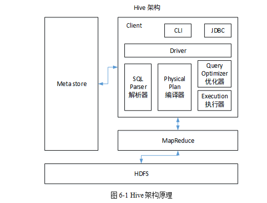{width="3.2708333333333335in"
> height="2.5347222222222223in"}

### 4.6.2 Hive和数据库比较

Hive 和数据库除了拥有类似的查询语言，再无类似之处。

1）数据存储位置

Hive 存储在 HDFS 。数据库将数据保存在块设备或者本地文件系统中。

2）数据更新

Hive中不建议对数据的改写。而数据库中的数据通常是需要经常进行修改的，

3）执行延迟

Hive 执行延迟较高。数据库的执行延迟较低。当然，这个是有条件的，即数据规模较小，当数据规模大到超过数据库的处理能力的时候，Hive的并行计算显然能体现出优势。

4）数据规模

Hive支持很大规模的数据计算；数据库可以支持的数据规模较小。

### 4.6.3 内部表和外部表

1）管理表：当我们删除一个管理表时，Hive也会删除这个表中数据。管理表不适合和其他工具共享数据。

2）外部表：删除该表并不会删除掉原始数据，删除的是表的元数据

### 4.6.4 4个By区别

1）Sort By：分区内有序；

2）Order By：全局排序，只有一个Reducer；

3）Distrbute By：类似MR中Partition，进行分区，结合sort by使用。

4） Cluster By：当Distribute by和Sorts by字段相同时，可以使用Cluster
by方式。Cluster by除了具有Distribute by的功能外还兼具Sort
by的功能。但是排序只能是升序排序，不能指定排序规则为ASC或者DESC。

### 4.6.5 窗口函数

> RANK() 排序相同时会重复，总数不会变
>
> DENSE\_RANK() 排序相同时会重复，总数会减少
>
> ROW\_NUMBER() 会根据顺序计算

1） OVER()：指定分析函数工作的数据窗口大小，这个数据窗口大小可能会随着行的变而变化

2）CURRENT ROW：当前行

3）n PRECEDING：往前n行数据

4） n FOLLOWING：往后n行数据

5）UNBOUNDED：起点，UNBOUNDED PRECEDING 表示从前面的起点，
UNBOUNDED FOLLOWING表示到后面的终点

6） LAG(col,n)：往前第n行数据

7）LEAD(col,n)：往后第n行数据

8） NTILE(n)：把有序分区中的行分发到指定数据的组中，各个组有编号，编号从1开始，对于每一行，NTILE返回此行所属的组的编号。注意：n必须为int类型。

### 4.6.6 自定义UDF、UDTF

在项目中是否自定义过UDF、UDTF函数，以及用他们处理了什么问题，及自定义步骤？

1）自定义过。

2）用UDF函数解析公共字段；用UDTF函数解析事件字段。

自定义UDF：继承UDF，重写evaluate方法

自定义UDTF：继承自GenericUDTF，重写3个方法：initialize(自定义输出的列名和类型)，process（将结果返回forward(result)），close

为什么要自定义UDF/UDTF，因为自定义函数，可以自己埋点Log打印日志，出错或者数据异常，方便调试.

### 4.6.7 Hive优化

> **1）MapJoin**

如果不指定MapJoin或者不符合MapJoin的条件，那么Hive解析器会将Join操作转换成Common
Join，即：在Reduce阶段完成join。容易发生数据倾斜。可以用MapJoin把小表全部加载到内存在map端进行join，避免reducer处理。

> **2）行列过滤**

列处理：在SELECT中，只拿需要的列，如果有，尽量使用分区过滤，少用SELECT
\*。

行处理：在分区剪裁中，当使用外关联时，如果将副表的过滤条件写在Where后面，那么就会先全表关联，之后再过滤。

> **3）采用分桶技术**
>
> **4）采用分区技术**
>
> **5）合理设置Map数**

**（1）通常情况下，作业会通过input的目录产生一个或者多个map任务。**

主要的决定因素有：input的文件总个数，input的文件大小，集群设置的文件块大小。

**（2）是不是map数越多越好？**

答案是否定的。如果一个任务有很多小文件（远远小于块大小128m），则每个小文件也会被当做一个块，用一个map任务来完成，而一个map任务启动和初始化的时间远远大于逻辑处理的时间，就会造成很大的资源浪费。而且，同时可执行的map数是受限的。

**（3）是不是保证每个map处理接近128m的文件块，就高枕无忧了？**

答案也是不一定。比如有一个127m的文件，正常会用一个map去完成，但这个文件只有一个或者两个小字段，却有几千万的记录，如果map处理的逻辑比较复杂，用一个map任务去做，肯定也比较耗时。

针对上面的问题2和3，我们需要采取两种方式来解决：即减少map数和增加map数；

> **6）小文件进行合并**

在Map执行前合并小文件，减少Map数：CombineHiveInputFormat具有对小文件进行合并的功能（系统默认的格式）。HiveInputFormat没有对小文件合并功能。

> **7）合理设置Reduce数**

Reduce个数并不是越多越好

（1）过多的启动和初始化Reduce也会消耗时间和资源；

（2）另外，有多少个Reduce，就会有多少个输出文件，如果生成了很多个小文件，那么如果这些小文件作为下一个任务的输入，则也会出现小文件过多的问题；

在设置Reduce个数的时候也需要考虑这两个原则：处理大数据量利用合适的Reduce数；使单个Reduce任务处理数据量大小要合适；

8.  **常用参数**

> // 输出合并小文件

SET hive.merge.mapfiles = true; \--
默认true，在map-only任务结束时合并小文件

SET hive.merge.mapredfiles = true; \--
默认false，在map-reduce任务结束时合并小文件

SET hive.merge.size.per.task = 268435456; \-- 默认256M

SET hive.merge.smallfiles.avgsize = 16777216; \--
当输出文件的平均大小小于该值时，启动一个独立的map-reduce任务进行文件merge

9.  **jvm重用**

4.7 HBase总结
-------------

### 4.7.1 HBase存储结构

{width="5.695138888888889in"
height="3.201388888888889in"}

### 4.7.1.1 HBase读数据流程

HRegionServer保存着meta表以及表数据，要访问表数据，首先Client先去访问zookeeper，从zookeeper里面获取meta表所在的位置信息，即找到这个meta表在哪个HRegionServer上保存着。

接着Client通过刚才获取到的HRegionServer的IP来访问Meta表所在的HRegionServer，从而读取到Meta，进而获取到Meta表中存放的元数据。

Client通过元数据中存储的信息，访问对应的HRegionServer，然后扫描所在HRegionServer的Memstore和Storefile来查询数据。

最后HRegionServer把查询到的数据响应给Client。

### 4.7.1.2 HBase写数据流程

Client也是先访问zookeeper，找到Meta表，并获取Meta表元数据。

确定当前将要写入的数据所对应的HRegion和HRegionServer服务器。

Client向该HRegionServer服务器发起写入数据请求，然后HRegionServer收到请求并响应。

Client先把数据写入到HLog，以防止数据丢失。

然后将数据写入到Memstore。

如果HLog和Memstore均写入成功，则这条数据写入成功

如果Memstore达到阈值，会把Memstore中的数据flush到Storefile中。

当Storefile越来越多，会触发Compact合并操作，把过多的Storefile合并成一个大的Storefile。

当Storefile越来越大，Region也会越来越大，达到阈值后，会触发Split操作，将Region一分为二。

### 4.7.2 rowkey设计原则

1）rowkey长度原则

2）rowkey散列原则

3）rowkey唯一原则

### 4.7.3 RowKey如何设计

> 1）生成随机数、hash、散列值
>
> 2）字符串反转

### 4.7.4 Phoenix二级索引（讲原理）

{width="1.0972222222222223in"
height="0.7013888888888888in"}

4.8 Sqoop参数
-------------

/opt/module/sqoop/bin/sqoop import \\

\--connect \\

\--username \\

\--password \\

\--target-dir \\

\--delete-target-dir \\

\--num-mappers \\

\--fields-terminated-by   \\

\--query   \"\$2\" \' and \$CONDITIONS;\'

### 4.8.1 Sqoop导入导出Null存储一致性问题

Hive中的Null在底层是以"\\N"来存储，而MySQL中的Null在底层就是Null，为了保证数据两端的一致性。在导出数据时采用\--input-null-string和\--input-null-non-string两个参数。导入数据时采用\--null-string和\--null-non-string。

### 4.8.2 Sqoop数据导出一致性问题

1）场景1：如Sqoop在导出到Mysql时，使用4个Map任务，过程中有2个任务失败，那此时MySQL中存储了另外两个Map任务导入的数据，此时老板正好看到了这个报表数据。而开发工程师发现任务失败后，会调试问题并最终将全部数据正确的导入MySQL，那后面老板再次看报表数据，发现本次看到的数据与之前的不一致，这在生产环境是不允许的。

官网：http://sqoop.apache.org/docs/1.4.6/SqoopUserGuide.html

Since Sqoop breaks down export process into multiple transactions, it is
possible that a failed export job may result in partial data being
committed to the database. This can further lead to subsequent jobs
failing due to insert collisions in some cases, or lead to duplicated
data in others. You can overcome this problem by specifying a staging
table via the \--staging-table option which acts as an auxiliary table
that is used to stage exported data. The staged data is finally moved to
the destination table in a single transaction.

--staging-table方式

sqoop export \--connect jdbc:mysql://192.168.137.10:3306/user\_behavior
\--username root \--password 123456 \--table app\_cource\_study\_report
\--columns watch\_video\_cnt,complete\_video\_cnt,dt
\--fields-terminated-by \"\\t\" \--export-dir
\"/user/hive/warehouse/tmp.db/app\_cource\_study\_analysis\_\${day}\"
\--staging-table app\_cource\_study\_report\_tmp \--clear-staging-table
\--input-null-string \'\\N\'

2）场景2：设置map数量为1个（不推荐，面试官想要的答案不只这个）

多个Map任务时，采用--staging-table方式，仍然可以解决数据一致性问题。

### 4.8.3 Sqoop底层运行的任务是什么

只有Map阶段，没有Reduce阶段的任务。

### 4.8.4 Sqoop数据导出的时候一次执行多长时间

Sqoop任务5分钟-2个小时的都有。取决于数据量。

4.9 Scala
---------

### 4.9.1 开发环境

要求掌握必要的scala开发环境搭建技能。

### 4.9.2 变量和数据类型

掌握var和val的区别

掌握数值类型（Byte、Short、Int、Long、Float、Double、Char）之间的转换关系

### 4.9.3 流程控制

掌握if-else、for、while等必要的流程控制结构，掌握如何实现break、continue的功能。

### 4.9.4 函数式编程

掌握高阶函数、匿名函数、函数柯里化、函数参数以及函数至简原则。

### 4.9.5 面向对象

掌握Scala与Java继承方面的区别、单例对象（伴生对象）、特质的用法及功能。

### 4.9.6 集合

掌握常用集合的使用、集合常用的计算函数。

### 4.9.7 模式匹配

掌握模式匹配的用法

### 4.9.8 异常

掌握异常常用操作即可

### 4.9.9 隐式转换

掌握隐式方法、隐式参数、隐式类，以及隐式解析机制

### 4.9.10 泛型

掌握泛型语法

4.10 Spark
----------

### 4.10.1 Spark有几种部署方式？请分别简要论述

1）Local:运行在一台机器上，通常是练手或者测试环境。

2）Standalone:构建一个基于Mster+Slaves的资源调度集群，Spark任务提交给Master运行。是Spark自身的一个调度系统。

3）Yarn:
Spark客户端直接连接Yarn，不需要额外构建Spark集群。有yarn-client和yarn-cluster两种模式，主要区别在于：Driver程序的运行节点。

4）Mesos：国内大环境比较少用。

### 4.10.2 Spark任务使用什么进行提交，JavaEE界面还是脚本

Shell 脚本。

### 4.10.3 Spark提交作业参数（重点）

参考答案：

https://blog.csdn.net/gamer\_gyt/article/details/79135118

1）在提交任务时的几个重要参数

> executor-cores ------
> 每个executor使用的内核数，默认为1，官方建议2-5个，我们企业是4个
>
> num-executors ------ 启动executors的数量，默认为2
>
> executor-memory ------ executor内存大小，默认1G
>
> driver-cores ------ driver使用内核数，默认为1
>
> driver-memory ------ driver内存大小，默认512M

2）边给一个提交任务的样式

> spark-submit \\
>
> \--master local\[5\] \\
>
> \--driver-cores 2 \\
>
> \--driver-memory 8g \\
>
> \--executor-cores 4 \\
>
> \--num-executors 10 \\
>
> \--executor-memory 8g \\
>
> \--class PackageName.ClassName XXXX.jar \\
>
> \--name \"Spark Job Name\" \\
>
> InputPath \\
>
> OutputPath

### 4.10.4 简述Spark的架构与作业提交流程（画图讲解，注明各个部分的作用）（重点）

{width="5.701388888888889in"
height="3.201388888888889in"}

### 4.10.4.1 Spark的交互流程 -- 任务运行

1、Application

用户编写的Spark程序，完成一个计算任务的处理。它是由一个Driver程序和一组运行于Spark集群上的Executor组成。

2、Job

用户程序中，每次调用Action时，逻辑上会生成一个Job，一个Job包含了多个Stage。

3、Stage

Stage包括两类：ShuffleMapStage和ResultStage，如果用户程序中调用了需要进行Shuffle计算的Operator，如groupByKey等，就会以Shuffle为边界分成ShuffleMapStage和ResultStage。

4、TaskSet

基于Stage可以直接映射为TaskSet，一个TaskSet封装了一次需要运算的、具有相同处理逻辑的Task，这些Task可以并行计算，粗粒度的调度是以TaskSet为单位的。

5、Task

Task是在物理节点上运行的基本单位，Task包含两类：ShuffleMapTask和ResultTask，分别对应于Stage中ShuffleMapStage和ResultStage中的一个执行基本单元。

### 4.10.5 如何理解Spark中的血统概念（RDD）（笔试重点）

RDD在Lineage依赖方面分为两种Narrow Dependencies与Wide
Dependencies用来解决数据容错时的高效性以及划分任务时候起到重要作用。

### 4.10.6 简述Spark的宽窄依赖，以及Spark如何划分stage，每个stage又根据什么决定task个数? （笔试重点）

Stage：根据RDD之间的依赖关系的不同将Job划分成不同的Stage，遇到一个宽依赖则划分一个Stage。

Task：Stage是一个TaskSet，将Stage根据分区数划分成一个个的Task。

### 4.10.7 请列举Spark的transformation算子（不少于8个），并简述功能（重点）

1）map（func）：返回一个新的RDD，该RDD由每一个输入元素经过func函数转换后组成.

2）mapPartitions(func)：类似于map，但独立地在RDD的每一个分片上运行，因此在类型为T的RD上运行时，func的函数类型必须是Iterator\[T\]
=\>
Iterator\[U\]。假设有N个元素，有M个分区，那么map的函数的将被调用N次,而mapPartitions被调用M次,一个函数一次处理所有分区。

3）reduceByKey（func，\[numTask\]）：在一个(K,V)的RDD上调用，返回一个(K,V)的RDD，使用定的reduce函数，将相同key的值聚合到一起，reduce任务的个数可以通过第二个可选的参数来设置。

4）aggregateByKey (zeroValue:U,\[partitioner: Partitioner\]) (seqOp: (U,
V) =\> U,combOp: (U, U) =\>
U: 在kv对的RDD中，，按key将value进行分组合并，合并时，将每个value和初始值作为seq函数的参数，进行计算，返回的结果作为一个新的kv对，然后再将结果按照key进行合并，最后将每个分组的value传递给combine函数进行计算（先将前两个value进行计算，将返回结果和下一个value传给combine函数，以此类推），将key与计算结果作为一个新的kv对输出。

5）combineByKey(createCombiner: V=\>C, mergeValue: (C, V) =\>C,
mergeCombiners: (C, C) =\>C):

对相同K，把V合并成一个集合。

1.createCombiner: combineByKey()
会遍历分区中的所有元素，因此每个元素的键要么还没有遇到过，要么就和之前的某个元素的键相同。如果这是一个新的元素,combineByKey()会使用一个叫作createCombiner()的函数来创建那个键对应的累加器的初始值

2.mergeValue: 如果这是一个在处理当前分区之前已经遇到的键，它会使用mergeValue()方法将该键的累加器对应的当前值与这个新的值进行合并

3.mergeCombiners: 由于每个分区都是独立处理的，
因此对于同一个键可以有多个累加器。如果有两个或者更多的分区都有对应同一个键的累加器，
就需要使用用户提供的 mergeCombiners() 方法将各个分区的结果进行合并。

...

根据自身情况选择比较熟悉的算子加以介绍。

### 4.10.8 请列举Spark的action算子（不少于6个），并简述功能（重点）

1）reduce：

2）collect:

3）first：

4）take：

5）aggregate：

6）countByKey：

7）foreach：

8）saveAsTextFile：

### 4.10.9 请列举会引起Shuffle过程的Spark算子，并简述功能。

reduceBykey：

groupByKey：

...ByKey:

### 4.10.10 简述Spark的两种核心Shuffle（HashShuffle与SortShuffle）的工作流程（包括未优化的HashShuffle、优化的HashShuffle、普通的SortShuffle与bypass的SortShuffle）（重点）

**未经优化的HashShuffle：**{width="5.5in"
height="3.0972222222222223in"}

执行流程：

1.每一个map
task将不同结果写到不同的buffer中，每个buffer的大小为32K。buffer起到数据缓存的作用。

2.每个buffer文件最后对应一个磁盘小文件。

3.reduce task来拉取对应的磁盘小文件。

存在问题：

1.  小文件过多，耗时低效的IO操作

2\. OOM，读写文件以及缓存过多

**优化后的HashShuffle：**

{width="5.695138888888889in"
height="3.201388888888889in"}

每个cput
中core中的所有task对应一个Buffler内存，这样就减少了落地小文件和IO开销，不过当reduce
tast有好多的时候，显然进行优化的方式也不好，于是延伸出了sortBuffle

**普通的SortShuffle：**

{width="5.798611111111111in"
height="3.298611111111111in"}执行流程

1.  map task
    的计算结果会写入到一个内存数据结构AppendOnlyMap里面，内存数据结构默认是5M

2.  在shuffle的时候会有一个定时器，不定期的去估算这个内存结构的大小，当内存结构中的数据超过5M时，比如现在内存结构中的数据为5.01M，那么他会申请5.01\*2-5=5.02M内存给内存数据结构。

3.  如果申请成功不会进行溢写，如果申请不成功，这时候会发生溢写磁盘。

4.  在溢写之前内存结构中的数据会进行排序分区

5.  然后开始溢写磁盘，写磁盘是以batch的形式去写，一个batch是1万条数据，

6.  map
    task执行完成后，会将这些磁盘小文件合并成一个大的磁盘文件，同时生成一个索引文件。

7.  reduce
    task去map端拉取数据的时候，首先解析索引文件，根据索引文件再去拉取对应的数据。

**ByPass运行机制**

触发该机制的条件：

1.  shuffle reduce 端的 task 数量小于
    > spark.shuffle.sort.bypassMergeThreshold
    > 参数值的时候，参数的值时（默认为 200）；

2.  不是聚合类的shuffle算子（比如reduceByKey）；

    运行该机制：

```{=html}
<!-- -->
```
1.  当前 stage 的每个 task 会将数据的 key 进行 hash，然后将相同 hash 的
    key
    锁对应的数据写入到同一个内存缓冲区，缓冲写满后会溢写到磁盘文件，这里和
    HashShuffleManager一致。

2.  然后会进入 merge
    阶段，将所有的磁盘文件合并成一个磁盘文件，并创建一个索引文件。

    相比较于普通机制，这里有两个地方不同：

```{=html}
<!-- -->
```
1.  将数据写入内存时候，普通模式是将数据写入 Map 或者 Array
    这样的内存数据结构中，这里是根据 key 的 Hash 值直接写入内存；

2.  该模式下在写入磁盘之前不会排序；

3.  磁盘写机制不同。

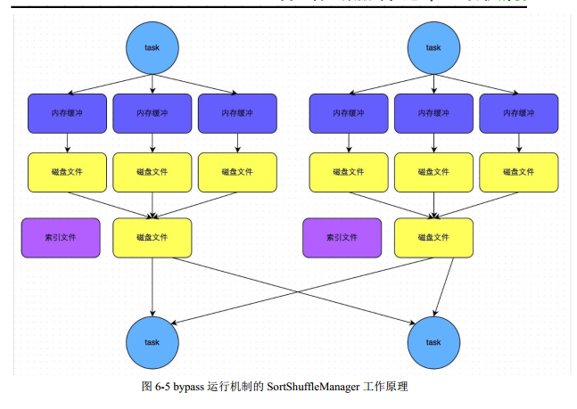{width="5.447222222222222in"
height="3.7909722222222224in"}

### 4.10.11 Spark常用算子reduceByKey与groupByKey的区别，哪一种更具优势？（重点）

reduceByKey：按照key进行聚合，在shuffle之前有combine（预聚合）操作，返回结果是RDD\[k,v\]。

groupByKey：按照key进行分组，直接进行shuffle。

开发指导：reduceByKey比groupByKey，建议使用。但是需要注意是否会影响业务逻辑。

### 4.10.12 Repartition和Coalesce关系与区别

1）关系：

两者都是用来改变RDD的partition数量的，repartition底层调用的就是coalesce方法：coalesce(numPartitions,
shuffle = true)

2）区别：

repartition一定会发生shuffle，coalesce根据传入的参数来判断是否发生shuffle

一般情况下增大rdd的partition数量使用repartition，减少partition数量时使用coalesce

### 4.10.13 分别简述Spark中的缓存机制（cache和persist）与checkpoint机制，并指出两者的区别与联系

都是做RDD持久化的

cache:内存，不会截断血缘关系，使用计算过程中的数据缓存。

checkpoint：磁盘，截断血缘关系，在ck之前必须没有任何任务提交才会生效，ck过程会额外提交一次任务。

### 4.10.14 简述Spark中共享变量（广播变量和累加器）的基本原理与用途。（重点）

累加器（accumulator）是Spark中提供的一种分布式的变量机制，其原理类似于mapreduce，即分布式的改变，然后聚合这些改变。累加器的一个常见用途是在调试时对作业执行过程中的事件进行计数。而广播变量用来高效分发较大的对象。

共享变量出现的原因：

通常在向 Spark 传递函数时，比如使用 map() 函数或者用 filter()
传条件时，可以使用驱动器程序中定义的变量，但是集群中运行的每个任务都会得到这些变量的一份新的副本，更新这些副本的值也不会影响驱动器中的对应变量。

Spark的两个共享变量，累加器与广播变量，分别为结果聚合与广播这两种常见的通信模式突破了这一限制。

### 4.10.15 当Spark涉及到数据库的操作时，如何减少Spark运行中的数据库连接数？

使用foreachPartition代替foreach，在foreachPartition内获取数据库的连接。

### 4.10.16 简述SparkSQL中RDD、DataFrame、DataSet三者的区别与联系? （笔试重点）

**1）RDD**

优点:

编译时类型安全 

编译时就能检查出类型错误

面向对象的编程风格 

直接通过类名点的方式来操作数据

缺点:

序列化和反序列化的性能开销 

无论是集群间的通信,
还是IO操作都需要对对象的结构和数据进行序列化和反序列化。

GC的性能开销，频繁的创建和销毁对象, 势必会增加GC

**2）DataFrame**

DataFrame引入了schema和off-heap

schema : RDD每一行的数据,
结构都是一样的，这个结构就存储在schema中。 Spark通过schema就能够读懂数据,
因此在通信和IO时就只需要序列化和反序列化数据, 而结构的部分就可以省略了。

**3）DataSet**

DataSet结合了RDD和DataFrame的优点，并带来的一个新的概念Encoder。

当序列化数据时，Encoder产生字节码与off-heap进行交互，能够达到按需访问数据的效果，而不用反序列化整个对象。Spark还没有提供自定义Encoder的API，但是未来会加入。

三者之间的转换：

{width="6.097222222222222in"
height="3.4027777777777777in"}

### 4.10.17 SparkSQL中join操作与left join操作的区别？

join和sql中的inner
join操作很相似，返回结果是前面一个集合和后面一个集合中匹配成功的，过滤掉关联不上的。

leftJoin类似于SQL中的左外关联left outer
join，返回结果以第一个RDD为主，关联不上的记录为空。

部分场景下可以使用left semi join替代left join：

因为 left semi join 是 in(keySet)
的关系，**遇到右表重复记录，左表会跳过,性能更高**，而 left join
则会一直遍历。但是left semi join 中最后 select
的结果中只许出现左表中的列名，因为右表只有 join key 参与关联计算了

### 4.10.18 SparkStreaming有哪几种方式消费Kafka中的数据，它们之间的区别是什么？ 

**一、基于Receiver的方式**

这种方式使用Receiver来获取数据。Receiver是使用Kafka的高层次Consumer
API来实现的。receiver从Kafka中获取的数据都是存储在Spark
Executor的内存中的（如果突然数据暴增，大量batch堆积，很容易出现内存溢出的问题），然后Spark
Streaming启动的job会去处理那些数据。

然而，在默认的配置下，这种方式可能会因为底层的失败而丢失数据。如果要启用高可靠机制，让数据零丢失，就必须启用Spark
Streaming的预写日志机制（Write Ahead
Log，WAL）。该机制会同步地将接收到的Kafka数据写入分布式文件系统（比如HDFS）上的预写日志中。所以，即使底层节点出现了失败，也可以使用预写日志中的数据进行恢复。

**二、基于Direct的方式**

这种新的不基于Receiver的直接方式，是在Spark
1.3中引入的，从而能够确保更加健壮的机制。替代掉使用Receiver来接收数据后，这种方式会周期性地查询Kafka，来获得每个topic+partition的最新的offset，从而定义每个batch的offset的范围。当处理数据的job启动时，就会使用Kafka的简单consumer
api来获取Kafka指定offset范围的数据。

**优点如下： **

**简化并行读取：**如果要读取多个partition，不需要创建多个输入DStream然后对它们进行union操作。Spark会创建跟Kafka
partition一样多的RDD partition，并且会并行从Kafka中读取数据。所以在Kafka
partition和RDD partition之间，有一个一对一的映射关系。

**高性能：**如果要保证零数据丢失，在基于receiver的方式中，需要开启WAL机制。这种方式其实效率低下，因为数据实际上被复制了两份，Kafka自己本身就有高可靠的机制，会对数据复制一份，而这里又会复制一份到WAL中。而基于direct的方式，不依赖Receiver，不需要开启WAL机制，只要Kafka中作了数据的复制，那么就可以通过Kafka的副本进行恢复。

**一次且仅一次的事务机制**。

**三、对比：**

基于receiver的方式，是使用Kafka的高阶API来在ZooKeeper中保存消费过的offset的。这是消费Kafka数据的传统方式。这种方式配合着WAL机制可以保证数据零丢失的高可靠性，但是却无法保证数据被处理一次且仅一次，可能会处理两次。因为Spark和ZooKeeper之间可能是不同步的。

基于direct的方式，使用kafka的简单api，Spark
Streaming自己就负责追踪消费的offset，并保存在checkpoint中。Spark自己一定是同步的，因此可以保证数据是消费一次且仅消费一次。

在实际生产环境中大都用Direct方式

### 4.10.19 简述SparkStreaming窗口函数的原理（重点）

窗口函数就是在原来定义的SparkStreaming计算批次大小的基础上再次进行封装，每次计算多个批次的数据，同时还需要传递一个滑动步长的参数，用来设置当次计算任务完成之后下一次从什么地方开始计算。

图中time1就是SparkStreaming计算批次大小，虚线框以及实线大框就是窗口的大小，必须为批次的整数倍。虚线框到大实线框的距离（相隔多少批次），就是滑动步长。

### 4.10.20 请手写出WordCount的Spark代码实现（Scala）（手写代码重点）

 val conf: SparkConf = new
SparkConf().setMaster(\"local\[\*\]\").setAppName(\"WordCount\")

 

val sc = new SparkContext(conf)

sc.textFile(\"/input\")

.flatMap(\_.split(\" \"))

.map((\_,1))

.reduceByKey(\_+\_)

.saveAsTextFile(\"/output\")

 sc.stop()

### 4.10.21 如何使用Spark实现TopN的获取（描述思路或使用伪代码）（重点）

方法1：

（1）按照key对数据进行聚合（groupByKey）

（2）将value转换为数组，利用scala的sortBy或者sortWith进行排序（mapValues）数据量太大，会OOM。

方法2：

（1）取出所有的key

（2）对key进行迭代，每次取出一个key利用spark的排序算子进行排序

方法3：

（1）自定义分区器，按照key进行分区，使不同的key进到不同的分区

（2）对每个分区运用spark的排序算子进行排序

### 4.10.22 京东：调优之前与调优之后性能的详细对比（例如调整map个数，map个数之前多少、之后多少，有什么提升）

这里举个例子。比如我们有几百个文件，会有几百个map出现，读取之后进行join操作，会非常的慢。这个时候我们可以进行coalesce操作，比如240个map，我们合成60个map，也就是窄依赖。这样再shuffle，过程产生的文件数会大大减少。提高join的时间性能。

4.11 Spark Sql、DataFrames、DataSet
-----------------------------------

### 4.11.1 append和overwrite的区别

append在原有分区上进行追加，overwrite在原有分区上进行全量刷新

### 4.11.2 coalesce和repartition的区别

coalesce和repartition都用于改变分区，coalesce用于缩小分区且不会进行shuffle，repartition用于增大分区（提供并行度）会进行shuffle,在spark中减少文件个数会使用coalesce来减少分区来到这个目的。但是如果数据量过大，分区数过少会出现OOM所以coalesce缩小分区个数也需合理

### 4.11.3 cache缓存级别

DataFrame的cache默认采用 MEMORY\_AND\_DISK 这和RDD 的默认方式不一样RDD
cache 默认采用MEMORY\_ONLY

### 4.11.4 释放缓存和缓存

缓存：(1)dataFrame.cache (2)sparkSession.catalog.cacheTable("tableName")

释放缓存：(1)dataFrame.unpersist
(2)sparkSession.catalog.uncacheTable("tableName")

### 4.11.4 Spark Shuffle默认并行度

参数spark.sql.shuffle.partitions 决定 默认并行度200

### 4.11.5 kryo序列化

kryo序列化比java序列化更快更紧凑，但spark默认的序列化是java序列化并不是spark序列化，因为spark并不支持所有序列化类型，而且每次使用都必须进行注册。注册只针对于RDD。在DataFrames和DataSet当中自动实现了kryo序列化。

### 4.11.6 创建临时表和全局临时表

DataFrame.createTempView() 创建普通临时表

DataFrame.createGlobalTempView() DataFrame.createOrReplaceTempView()
创建全局临时表

### 4.11.7 BroadCast join 广播join

原理：先将小表数据查询出来聚合到driver端，再广播到各个executor端，使表与表join时

进行本地join，避免进行网络传输产生shuffle。

使用场景：大表join小表 只能广播小表

### 4.11.7 控制Spark reduce缓存 调优shuffle

spark.reducer.maxSizeInFilght 此参数为reduce
task能够拉取多少数据量的一个参数默认48MB，当集群资源足够时，增大此参数可减少reduce拉取数据量的次数，从而达到优化shuffle的效果，一般调大为96MB,资源够大可继续往上跳。

spark.shuffle.file.buffer
此参数为每个shuffle文件输出流的内存缓冲区大小，调大此参数可以减少在创建shuffle文件时进行磁盘搜索和系统调用的次数，默认参数为32k
一般调大为64k。

### 4.11.7 注册UDF函数

SparkSession.udf.register 方法进行注册

4.12 Spark Streaming
--------------------

### 4.12.1 Spark Streaming第一次运行不丢失数据

kafka参数 auto.offset.reset 参数设置成earliest
从最初始偏移量开始消费数据

### 4.12.2 Spark Streaming精准一次消费

1.  手动维护偏移量

2.  处理完业务数据后，再进行提交偏移量操作

极端情况下，如在提交偏移量时断网或停电会造成spark程序第二次启动时重复消费问题，所以在涉及到金额或精确性非常高的场景会使用事物保证精准一次消费

### 4.12.3 Spark Streaming控制每秒消费数据的速度

通过spark.streaming.kafka.maxRatePerPartition参数来设置Spark
Streaming从kafka分区每秒拉取的条数

### 4.12.4 Spark Streaming背压机制

把spark.streaming.backpressure.enabled
参数设置为ture,开启背压机制后Spark
Streaming会根据延迟动态去kafka消费数据,上限由spark.streaming.kafka.maxRatePerPartition参数控制，所以两个参数一般会一起使用

### 4.12.5 Spark Streaming 一个stage耗时

Spark Streaming
stage耗时由最慢的task决定,所以数据倾斜时某个task运行慢会导致整个Spark
Streaming都运行非常慢。

### 4.12.6 Spark Streaming 优雅关闭

把spark.streaming.stopGracefullyOnShutdown参数设置成ture,Spark会在JVM关闭时正常关闭StreamingContext,而不是立马关闭

Kill 命令：yarn application -kill 后面跟 applicationid

### 4.12.6 Spark Streaming 默认分区个数

Spark Streaming默认分区个数与所对接的kafka topic分区个数一致，Spark
Streaming里一般不会使用repartition算子增大分区，因为repartition会进行shuffle增加耗时

4.13 元数据管理（Atlas血缘系统）
--------------------------------

<https://www.cnblogs.com/mantoudev/p/9986408.html>

4.14 数据质量监控（Griffin）
----------------------------

<https://blog.csdn.net/An342647823/article/details/86543432>

第5章 用户行为数据分析
======================

5.1 数仓分层架构表
------------------

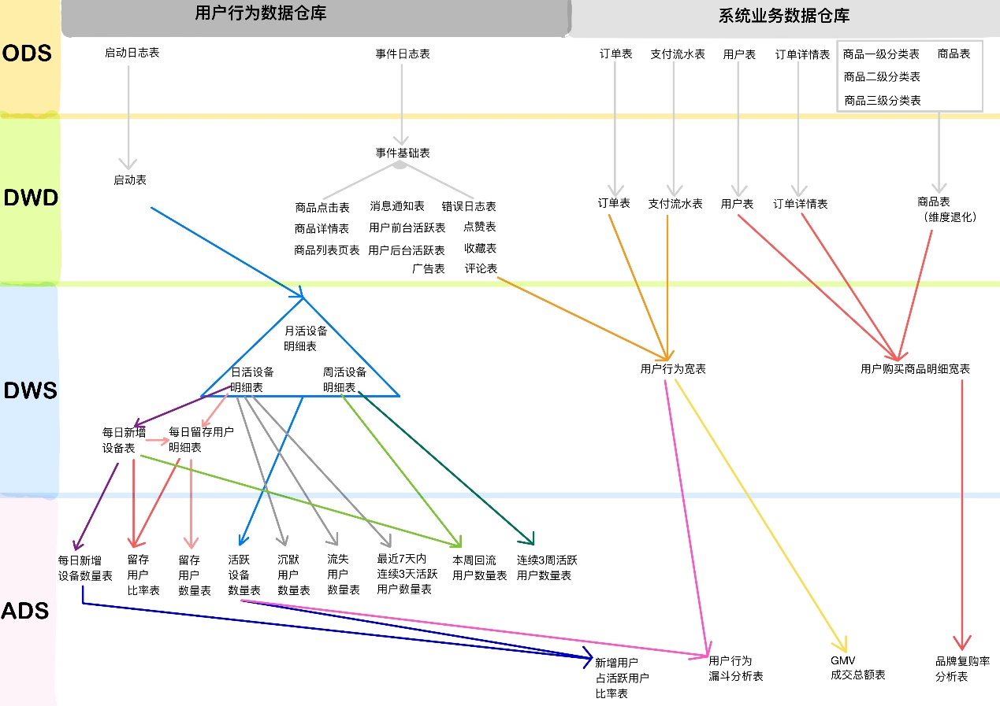{width="5.7659722222222225in"
height="4.0777777777777775in"}

分层优点：复杂问题简单化、清晰数据结构(方便管理)、增加数据的复用性、隔离原始数据(解耦)

> ods 原始数据层 存放原始数据，保持原貌不做处理
>
> dwd 明细数据层 对ods层数据清洗（去除空值，脏数据，超过极限范围的数据）
>
> dws 服务数据层 轻度聚合
>
> ads 应用数据层 具体需求

数仓中各层建的表都是外部表

5.2 埋点行为数据基本格式(基本字段)
----------------------------------

公共字段：基本所有安卓手机都包含的字段

业务字段：埋点上报的字段，有具体的业务类型

下面就是一个示例，表示业务字段的上传。

行为数据启动日志/事件日志表关键字段:

{

\"ap\":\"xxxxx\",//项目数据来源 app pc

\"cm\": { //公共字段

**\"mid\": \"\", // (String) 设备唯一标识**

**\"uid\": \"\", // (String) 用户标识**

\"vc\": \"1\", // (String) versionCode，程序版本号

\"vn\": \"1.0\", // (String) versionName，程序版本名

\"l\": \"zh\", // (String) 系统语言

**\"sr\": \"\", // (String) 渠道号，应用从哪个渠道来的。**

\"os\": \"7.1.1\", // (String) Android系统版本

\"ar\": \"CN\", // (String) 区域

\"md\": \"BBB100-1\", // (String) 手机型号

**\"ba\": \"blackberry\", // (String) 手机品牌**

\"sv\": \"V2.2.1\", // (String) sdkVersion

\"g\": \"\", // (String) gmail

**\"hw\": \"1620x1080\", // (String) heightXwidth，屏幕宽高**

\"t\": \"1506047606608\", // (String) 客户端日志产生时的时间

**\"nw\": \"WIFI\", // (String) 网络模式**

\"ln\": 0, // (double) lng经度

\"la\": 0 // (double) lat 纬度

},

\"et\": \[ //事件

{

\"ett\": \"1506047605364\", //客户端事件产生时间

\"en\": \"display\", //事件名称 启动和事件日志是根据事件名称的不同

\"kv\": { //事件结果，以key-value形式自行定义

\"goodsid\": \"236\",

\"action\": \"1\",

\"extend1\": \"1\",

> \"place\": \"2\",
>
> \"category\": \"75\"

}

}

\]

}

根据事件标签的不同可以分成不同的日志表

5.3 项目经验总结
----------------

### 5.3.1 项目经验之元数据备份

元数据备份（重点，如数据损坏，可能整个集群无法运行，至少要保证每日零点之后备份到其它服务器两个复本）
或者mycat

{width="1.0972222222222223in"
height="0.7013888888888888in"}

### 5.3.2 日期处理函数

1）date\_format函数（根据格式整理日期）

2）date\_add、date\_sub函数（加减日期）

3）next\_day函数

4）last\_day函数（求当月最后一天日期）

5）collect\_set函数

6）get\_json\_object解析json函数

### 5.3.3 Union与Union all区别

1）union会将联合的结果集去重，效率较union all差

2）union all不会对结果集去重，所以效率高

### 5.3.4 Shell中单引号和双引号区别

1）在/home/atguigu/bin创建一个test.sh文件

\[atguigu\@hadoop102 bin\]\$ vim test.sh

在文件中添加如下内容

\#!/bin/bash

do\_date=\$1

echo \'\$do\_date\'

echo \"\$do\_date\"

echo \"\'\$do\_date\'\"

echo \'\"\$do\_date\"\'

echo \`date\`

2）查看执行结果

\[atguigu\@hadoop102 bin\]\$ test.sh 2019-02-10

\$do\_date

2019-02-10

\'2019-02-10\'

\"\$do\_date\"

2019年 05月 02日 星期四 21:02:08 CST

3）总结：

（1）单引号不取变量值

（2）双引号取变量值

（3）反引号\`，执行引号中命令

（4）双引号内部嵌套单引号，取出变量值

（5）单引号内部嵌套双引号，不取出变量值

### 5.3.5 Tez引擎优点？

Tez可以将多个有依赖的作业转换为一个作业，这样只需写一次HDFS，且中间节点较少，从而大大提升作业的计算性能。

5.4 ods层
---------

1）ods\_start\_log 启动日志表

只有一个字段 line（保存着json），按照日期dt分区，表的格式：lzo

2）ods\_event\_log 事件日志表

只有一个字段 line ，按照日期dt 分区，表的格式：lzo

5.5 dwd层
---------

1）dwd\_start\_log 启动表

关键字段：mid\_id，user\_id，dt(分区字段，按照日期分区)
（其实这是启动表和事件表的公共字段）

从ods\_start\_log中的line用get\_json\_object(line，\'\$.mid\')
mid\_id的方式获取字段

### 5.5.1 自定义UDF/UDTF（项目中的应用）

自定义UDF函数（解析公共字段，一进一出）

自定义UDTF函数（解析具体事件字段，一进多出）

自定义UDF：继承UDF，重写evaluate方法

自定义UDTF：继承自GenericUDTF，重写3个方法：initialize(自定义输出的列名和类型)，process（将结果返回forward(result)），close

为什么要自定义UDF/UDTF，因为自定义函数，可以自己埋点Log打印日志，出错或者数据异常，方便调试。

### 5.5.2 事件日志基础明细表

dwd\_base\_event\_log 事件日志基础明细表

1）关键字段：

公共字段：mid\_id，user\_id，dt(分区字段)以及event\_name、event\_json、server\_time

2）从 ods\_event\_log的line 中用 UDF 获取 公共字段 和
server\_time，用UDTF 获取 event\_name , event\_json 。

### 5.5.3 商品点击表

dwd\_display\_log 商品点击表

关键字段：公共字段 + 特有字段

从dwd\_base\_event\_log中直接获取公共字段和server\_time，从
dwd\_base\_event\_log的 event\_json中获取特有字段，where event\_name =
\"display\"

get\_json\_object(event\_json,\'\$.kv.action\') action

### 5.5.4 其他的具体事件明细表

> 类似
>
> dwd\_newsdetail\_log 商品详情页表
>
> dwd\_loading\_log 商品列表页表
>
> dwd\_ad\_log 广告表
>
> dwd\_notification\_log 消息通知表
>
> dwd\_active\_foreground\_log 用户前台活跃表
>
> dwd\_active\_background\_log 用户后台活跃表
>
> dwd\_comment\_log 评论表
>
> dwd\_favorites\_log 收藏表
>
> dwd\_praise\_log 点赞表
>
> dwd\_error\_log 错误日志表
>
> 从一张事件基础明细表dwd\_base\_event\_log一共可以获得11张具体事件明细表

5.6 需求一：用户活跃主题
------------------------

### 5.6.1 DWS层日活明细表

{width="5.695138888888889in"
height="3.298611111111111in"}

### 5.6.2 DWS层周活明细表

{width="5.695138888888889in"
height="3.298611111111111in"}

### 5.6.3 DWS层月活明细表

{width="5.798611111111111in"
height="3.298611111111111in"}

### 5.6.4 ADS层日周月活跃设备数表

{width="5.798611111111111in"
height="3.201388888888889in"}

5.7 需求二：用户新增主题
------------------------

### 5.7.1 DWS层日新增明细表

{width="5.798611111111111in"
height="3.298611111111111in"}

{width="5.798611111111111in"
height="3.201388888888889in"}

### 5.7.2 ADS层每日新增设备数表

{width="5.701388888888889in"
height="3.201388888888889in"}

5.8 需求三：用户留存主题
------------------------

{width="5.597222222222222in"
height="3.201388888888889in"}

{width="5.798611111111111in"
height="3.201388888888889in"}

### 5.8.1 DWS层日留存明细表

{width="5.695138888888889in"
height="3.201388888888889in"}

### 5.8.2 ADS层留存用户数表

{width="5.701388888888889in"
height="3.201388888888889in"}

### 5.8.3 ADS层留存用户率表

{width="5.701388888888889in"
height="3.201388888888889in"}

5.9 需求四：沉默用户
--------------------

{width="5.701388888888889in"
height="3.201388888888889in"}

5.10 需求五：本周回流用户数
---------------------------

{width="5.701388888888889in"
height="3.201388888888889in"}

5.11 需求六：流失用户数
-----------------------

{width="5.701388888888889in"
height="3.201388888888889in"}

5.12 需求七：最近连续3周活跃用户数
----------------------------------

{width="5.701388888888889in"
height="3.201388888888889in"}

5.13 需求八：最近七天内连续三天活跃用户数
-----------------------------------------

{width="5.701388888888889in"
height="3.201388888888889in"}

5.14 需求逻辑
-------------

### 5.14.1 如何分析用户活跃？

在启动日志中统计不同设备id出现次数。

### 5.14.2 如何分析用户新增？

用活跃用户表 left join 用户新增表，用户新增表中mid为空的即为用户新增。

### 5.14.3 如何分析用户1天留存？

留存用户=前一天新增 join 今天活跃

用户留存率=留存用户/前一天新增

### 5.14.4 如何分析沉默用户？

(登录时间为7天前,且只出现过一次)

按照设备id对日活表分组，登录次数为1，且是在一周前登录。

### 5.14.5 如何分析本周回流用户？

本周活跃left join本周新增 left
join上周活跃，且本周新增id和上周活跃id都为null

### 5.14.6 如何分析流失用户？

(登录时间为7天前)

按照设备id对日活表分组，且七天内没有登录过。

### 5.14.7 如何分析最近连续3周活跃用户数？

按照设备id对周活进行分组，统计次数大于3次。

### 5.14.8 如何分析最近七天内连续三天活跃用户数？

1）查询出最近7天的活跃用户，并对用户活跃日期进行排名

2）计算用户活跃日期及排名之间的差值

3）对同用户及差值分组，统计差值个数

4）将差值相同个数大于等于3的数据取出，然后去重(去的是什么重???)，即为连续3天及以上活跃的用户

第6章 业务交互数据分析
======================

6.1 电商常识
------------

SKU：一台银色、128G内存的、支持联通网络的iPhoneX

SPU：iPhoneX

Tm\_id：品牌Id苹果，包括IPHONE，耳机，mac等

6.2 电商业务流程
----------------

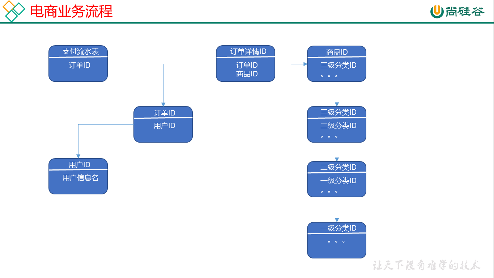{width="5.768055555555556in"
height="3.2430555555555554in"}

6.3 业务表关键字段
------------------

### 6.3.1 订单表（order\_info）

  ---------------- ------------
  标签             含义
  id               订单编号
  total\_amount    订单金额
  order\_status    订单状态
  user\_id         用户id
  payment\_way     支付方式
  out\_trade\_no   支付流水号
  create\_time     创建时间
  operate\_time    操作时间
  ---------------- ------------

### 6.3.2 订单详情表（order\_detail）

  -------------- ----------
  标签           含义
  id             订单编号
  order\_id      订单号
  user\_id       用户id
  sku\_id        商品id
  sku\_name      商品名称
  order\_price   商品价格
  sku\_num       商品数量
  create\_time   创建时间
  -------------- ----------

### 6.3.3 商品表

  --------------- ----------
  标签            含义
  id              skuId
  spu\_id         spuid
  price           价格
  sku\_name       商品名称
  sku\_desc       商品描述
  weight          重量
  tm\_id          品牌id
  category3\_id   品类id
  create\_time    创建时间
  --------------- ----------

### 6.3.4 用户表

  -------------- ----------
  标签           含义
  id             用户id
  name           姓名
  birthday       生日
  gender         性别
  email          邮箱
  user\_level    用户等级
  create\_time   创建时间
  -------------- ----------

### 6.3.5 商品一级分类表

  ------ ------
  标签   含义
  id     id
  name   名称
  ------ ------

### 6.3.6 商品二级分类表

  --------------- ------------
  标签            含义
  id              id
  name            名称
  category1\_id   一级品类id
  --------------- ------------

### 6.3.7 商品三级分类表

  --------------- ------------
  标签            含义
  id              id
  name            名称
  Category2\_id   二级品类id
  --------------- ------------

### 6.3.8 支付流水表

  ------------------- --------------------
  标签                含义
  id                  编号
  out\_trade\_no      对外业务编号
  order\_id           订单编号
  user\_id            用户编号
  alipay\_trade\_no   支付宝交易流水编号
  total\_amount       支付金额
  subject             交易内容
  payment\_type       支付类型
  payment\_time       支付时间
  ------------------- --------------------

订单表跟订单详情表有什么区别？

订单表的订单状态会变化，订单详情表不会，因为没有订单状态。

订单表记录user\_id，订单id订单编号，订单的总金额order\_status，支付方式，订单状态等。

订单详情表记录user\_id，商品sku\_id
,具体的商品信息（商品名称sku\_name，价格order\_price，数量sku\_num）

6.4 MySql中表的分类
-------------------

实体表，维度表，事务型事实表，周期性事实表

其实最终可以把事务型事实表，周期性事实表统称实体表，实体表，维度表统称维度表

订单表（order\_info）（周期型事实表）

订单详情表（order\_detail）(事务型事实表)

商品表(实体表)

用户表(实体表)

商品一级分类表(维度表)

商品二级分类表(维度表)

商品三级分类表(维度表)

支付流水表(事务型实体表)

6.5 同步策略
------------

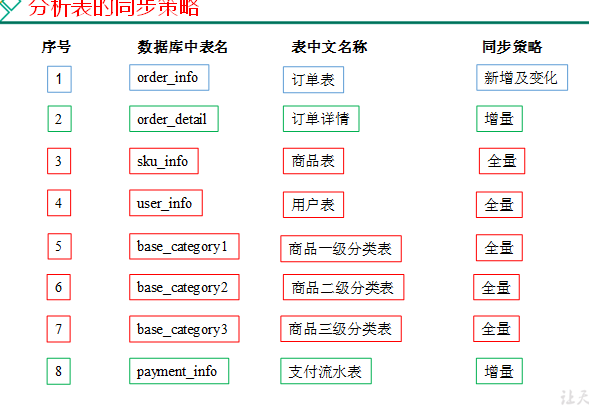{width="5.385416666666667in"
height="3.484722222222222in"}

实体表，维度表统称维度表，每日全量或者每月（更长时间）全量

事务型事实表：每日增量

周期性事实表：拉链表

6.6 关系型数据库范式理论
------------------------

1NF：属性不可再分割（例如不能存在5台电脑的属性，坏处：表都没法用）

2NF：不能存在部分函数依赖（例如主键（学号+课名）\--\>成绩，姓名，但学号\--》姓名，所以姓名部分依赖于主键（学号+课名），所以要去除，坏处：数据冗余）

3NF：不能存在传递函数依赖（学号\--》宿舍种类\--》价钱，坏处：数据冗余和增删异常）

Mysql关系模型：关系模型主要应用与OLTP系统中，为了保证数据的一致性以及避免冗余，所以大部分业务系统的表都是遵循第三范式的。

Hive 维度模型：维度模型主要应用于OLAP系统中，因为关系模型虽然冗余少，

但是在大规模数据，跨表分析统计查询过程中，会造成多表关联，这会大大降低执行效率。

所以HIVE把相关各种表整理成两种：事实表和维度表两种。所有维度表围绕着事实表进行解释。

6.7 数据模型
------------

雪花模型、星型模型和星座模型

（在维度建模的基础上又分为三种模型：星型模型、雪花模型、星座模型。）

星型模型（一级维度表），雪花（多级维度），星座模型（星型模型+多个事实表）

6.8 业务数据数仓搭建
--------------------

sqoop

导数据的原理是mapreduce,

import 把数据从关系型数据库 导到 数据仓库，自定义InputFormat，

export 把数据从数据仓库 导到 关系型数据库，自定义OutputFormat，

用sqoop从mysql中将八张表的数据导入数仓的ods原始数据层

全量无条件，增量按照创建时间，增量+变化按照创建时间或操作时间。

origin\_data

sku\_info商品表（每日导全量）

user\_info用户表（每日导全量）

base\_category1商品一级分类表（每日导全量）

base\_category2商品二级分类表（每日导全量）

base\_category3商品三级分类表（每日导全量）

order\_detail订单详情表（每日导增量）

payment\_info支付流水表（每日导增量）

order\_info订单表（每日导增量+变化）

### 6.8.1 ods层

（八张表，表名，字段跟mysql完全相同）

从origin\_data把数据导入到ods层，表名在原表名前加ods\_

### 6.8.2 dwd层

对ODS层数据进行判空过滤。对商品分类表进行维度退化(降维)。其他数据跟ods层一模一样

订单表 dwd\_order\_info

订单详情表 dwd\_order\_detail

用户表 dwd\_user\_info

支付流水表 dwd\_payment\_info

商品表 dwd\_sku\_info

其他表字段不变，唯独商品表，通过关联3张分类表，增加了

category2\_id\` string COMMENT \'2id\',

\`category1\_id\` string COMMENT \'3id\',

\`category3\_name\` string COMMENT \'3\',

\`category2\_name\` string COMMENT \'2\',

\`category1\_name\` string COMMENT \'1\',

小结：

1）维度退化要付出什么代价？或者说会造成什么样的需求处理不了？

如果被退化的维度，还有其他业务表使用，退化后处理起来就麻烦些。

还有如果要删除数据，对应的维度可能也会被永久删除。

2）想想在实际业务中还有那些维度表可以退化

城市的三级分类（省、市、县）等

### 6.8.3 dws层

{width="5.695138888888889in"
height="3.201388888888889in"}

> 从订单表 dwd\_order\_info 中获取 下单次数 和 下单总金额
>
> 从支付流水表 dwd\_payment\_info 中获取 支付次数 和 支付总金额
>
> 从事件日志评论表 dwd\_comment\_log 中获取评论次数

最终按照user\_id聚合，获得明细，跟之前的mid\_id聚合不同

6.9 需求一：GMV成交总额
-----------------------

{width="5.701388888888889in"
height="3.201388888888889in"}

> 从用户行为宽表中dws\_user\_action，根据统计日期分组，聚合，直接sum就可以了。

6.10 需求二：转化率
-------------------

### 6.10.1 新增用户占日活跃用户比率表

{width="5.695138888888889in"
height="3.201388888888889in"}

> 从日活跃数表 ads\_uv\_count 和 日新增设备数表 ads\_new\_mid\_count
> 中取即可。

### 6.10.2 用户行为转化率表

{width="5.701388888888889in"
height="3.201388888888889in"}

从用户行为宽表dws\_user\_action中取，下单人数（只要下单次数\>0）,支付人数（只要支付次数\>0）

> 从日活跃数表 ads\_uv\_count 中取活跃人数，然后对应的相除就可以了。

6.11 需求三：品牌复购率
-----------------------

> 需求：以月为单位统计，购买2次以上商品的用户

### 6.11.1 用户购买商品明细表（宽表）

{width="5.701388888888889in"
height="3.201388888888889in"}

### 6.11.2 品牌复购率表

{width="5.701388888888889in"
height="3.201388888888889in"}

> 从用户购买商品明细宽表dws\_sale\_detail\_daycount中，根据品牌id\--sku\_tm\_id聚合，计算每个品牌购买的总次数，购买人数a=购买次数\>=1,两次及以上购买人数b=购买次数\>=2，三次及以上购买人数c=购买次数\>=3,
>
> 单次复购率=b/a，多次复购率=c/a

6.12 项目中有多少张宽表
-----------------------

宽表要3-5张，用户行为宽表，用户购买商品明细行为宽表，商品宽表，购物车宽表，物流宽表、登录注册、售后等。

1）为什么要建宽表

需求目标，把每个用户单日的行为聚合起来组成一张多列宽表，以便之后关联用户维度信息后进行，不同角度的统计分析。

6.13 拉链表
-----------

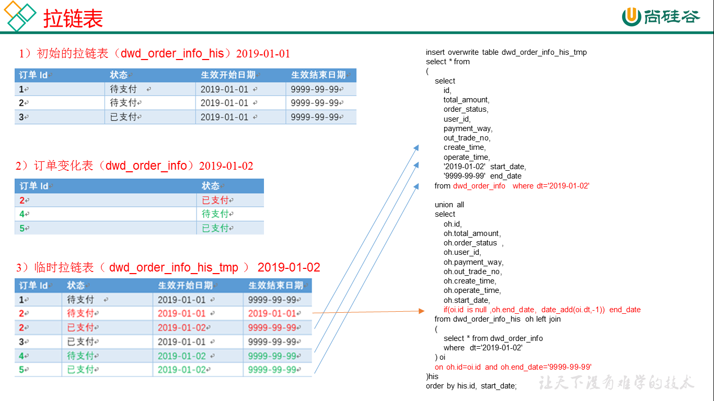{width="5.768055555555556in"
height="3.2430555555555554in"}

拉链表处理的业务场景：主要处理缓慢变化维的业务场景。

订单表拉链表 dwd\_order\_info\_his

\`id\` string COMMENT \'订单编号\',

\`total\_amount\` decimal(10,2) COMMENT \'订单金额\',

\`order\_status\` string COMMENT \'订单状态\',

\`user\_id\` string COMMENT \'用户id\' ,

\`payment\_way\` string COMMENT \'支付方式\',

\`out\_trade\_no\` string COMMENT \'支付流水号\',

\`create\_time\` string COMMENT \'创建时间\',

\`operate\_time\` string COMMENT \'操作时间\' ,

\`start\_date\` string COMMENT \'有效开始日期\',

\`end\_date\` string COMMENT \'有效结束日期\'

1）创建订单表拉链表，字段跟拉链表一样，只增加了有效开始日期和有效结束日期

初始日期，从订单变化表ods\_order\_info导入数据，且让有效开始时间=当前日期，有效结束日期=9999-99-99

（从mysql导入数仓的时候就只导了新增的和变化的数据ods\_order\_info，dwd\_order\_info跟ods\_order\_info基本一样，只多了一个id的判空处理）

2）建一张拉链临时表dwd\_order\_info\_his\_tmp，字段跟拉链表完全一致

3）新的拉链表中应该有这几部分数据，

（1）增加订单变化表dwd\_order\_info的全部数据

（2）更新旧的拉链表左关联订单变化表dwd\_order\_info，关联字段：订单id,
where
过滤出end\_date只等于9999-99-99的数据，如果旧的拉链表中的end\_date不等于9999-99-99，说明已经是终态了，不需要再更新

如果dwd\_order\_info.id is null ,
没关联上，说明数据状态没变，让end\_date还等于旧的end\_date

如果dwd\_order\_info.id is not null ,
关联上了，说明数据状态变了，让end\_date等于当前日期-1

把查询结果插入到拉链临时表中

4）把拉链临时表覆盖到旧的拉链表中

第7章 即席查询数据仓库
======================

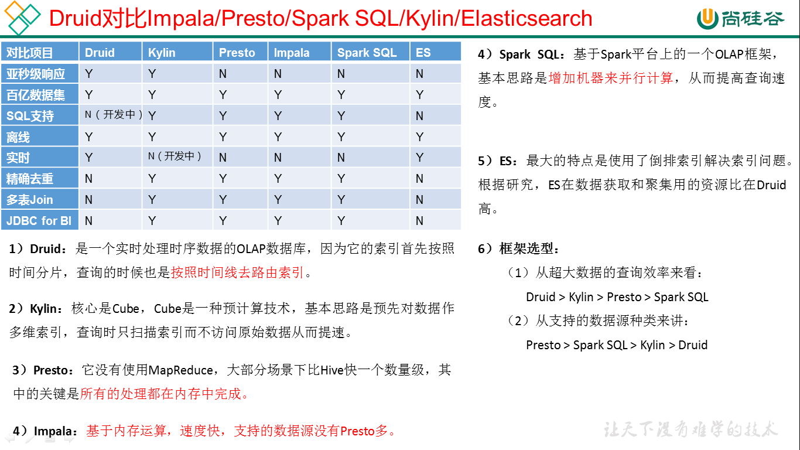{width="5.768055555555556in"
height="3.2430555555555554in"}

Kylin: T+1

Impala: CDH

Presto: Apache版本框架

第8章 项目开发经验
==================

8.1 项目开发中遇到哪些问题
--------------------------

### 8.1.1 Hadoop

1）Hadoop集群基准测试（HDFS的读写性能、MapReduce的计算能力测试）

2）一台服务器一般都有很多个硬盘插槽（插了几个插槽）

如果不配置datanode.data.dir多目录，每次插入一块新的硬盘都需要重启服务器

配置了即插即用

3）Hdfs参数调优**（项目中遇到的问题）**

> Namenode有一个工作线程池，用来处理与datanode的心跳（报告自身的健康状况和文件恢复请求）和元数据请求
> dfs.namenode.handler.count=20 \* log2(Cluster Size)

4）编辑日志存储路径dfs.namenode.edits.dir设置与镜像文件存储路径dfs.namenode.name.dir尽量分开，达到最低写入延迟（提高写入的吞吐量）

5）YARN参数调优yarn-site.xml**（项目中遇到的问题）**

（1）服务器节点上YARN可使用的物理内存总量，默认是8192（MB）

（2）单个任务可申请的最多物理内存量，默认是8192（MB）。

6）HDFS和硬盘使用控制在70%以下。

**7）Hadoop宕机（项目中遇到的问题）**

（1）如果MR造成系统宕机。此时要控制Yarn同时运行的任务数，和每个任务申请的最大内存。调整参数：yarn.scheduler.maximum-allocation-mb（单个任务可申请的最多物理内存量，默认是8192MB）

（2）如果写入文件过量造成NameNode宕机。那么调高Kafka的存储大小，控制从Kafka到HDFS的写入速度。高峰期的时候用Kafka进行缓存，高峰期过去数据同步会自动跟上。

### 8.1.2 Flume

1）Flume内存配置为4G（flume-env.sh修改）

2）FileChannel优化

通过配置dataDirs指向多个路径，每个路径对应不同的硬盘，增大Flume吞吐量。

checkpointDir和backupCheckpointDir也尽量配置在不同硬盘对应的目录中，保证checkpoint坏掉后，可以快速使用backupCheckpointDir恢复数据

3）Sink：HDFS Sink小文件处理

这三个参数配置写入HDFS后会产生小文件，hdfs.rollInterval、hdfs.rollSize、hdfs.rollCount

**4）Ganglia监控（项目中遇到的问题）**

Ganglia监控Flume发现发现尝试提交的次数大于最终成功的次数

（1）增加Flume内存

（2）增加Flume台数

### 8.1.3 Kafka

1)  Kafka的吞吐量测试（测试生产速度和消费速度）

2)  Kafka内存为6G（不能超过6G）

3)  Kafka数量确定：2 \* 峰值生产速度（m/s）\* 副本数 / 100 + 1 = ?

4)  Kafka中的数据量计算

> 每天数据总量100g(1亿条) 10000万/24/60/60 = 1150条/s
>
> 平均每秒钟：1150条
>
> 低谷每秒：400条
>
> 高峰每秒钟：1150 \* 10 = 11000 条
>
> 每条日志大小： 1K左右
>
> 每秒多少数据量：20MB

5)  **Kafka消息数据积压，Kafka消费能力不足怎么处理？
    （项目中遇到的问题）**

（1）如果是Kafka消费能力不足，则可以考虑增加Topic的分区数，并且同时提升消费组的消费者数量，消费者数=分区数。（两者缺一不可）

（2）如果是下游的数据处理不及时：提高每批次拉取的数量。批次拉取数据过少（拉取数据/处理时间\<生产速度），使处理的数据小于生产的数据，也会造成数据积压。

6)  **Kafka挂掉（项目中遇到的问题）**

> （1）Flume Channel可以缓存一段时间，短期没事
>
> （2）日志服务器有30天记录，可以重写跑

7)  **Kafka数据重复（项目中遇到的问题）**

> **幂等性+ack-1+事务**

在下一级消费者中去重。（redis、SparkStreaming、hive的dwd层）

### 8.1.4 Hive 

1）自定义UDF和UDTF解析和调试复杂字段

自定义UDF（extends UDF 实现evaluate方法） 解析公共字段

> 自定义UDTF(extends Genertic
> UDTF-\>实现三个方法init(指定返回值的名称和类型)、process(处理字段一进多出)、close方法)
> -\> 更加灵活以及方便定义bug

2）Hive优化

### 8.1.5 MySql 

**1）MySQL之元数据备份（项目中遇到的问题）**

元数据备份（重点，如数据损坏，可能整个集群无法运行，至少要保证每日零点之后备份到其它服务器两个复本）

{width="1.0972222222222223in"
height="0.7013888888888888in"} Keepalived或者用mycat

2）Mysql utf8超过字节数问题

Mysql的utf8编码最多存储3个字节，当数据中存在表情号、特色符号时会占用超过3个字节数的字节，那么会出现错误
Incorrect string value: \'\\xF0\\x9F\\x91\\x91\\xE5\\xB0\...\'

解决办法：将utf8修改为utf8mb4

首先修改库的基字符集和数据库排序规则

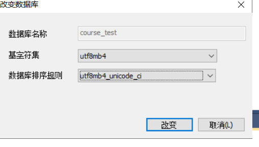{width="4.0368055555555555in"
height="2.1638888888888888in"}

再使用 SHOW VARIABLES LIKE \'%char%\'; 命令查看参数

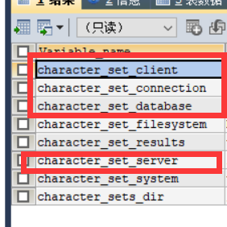{width="2.35in" height="2.186111111111111in"}

确保这几个参数的value值为utf8mb4 如果不是使用set命令修改

如：set character\_set\_server = utf8mb4;

### 8.1.6 Tez引擎优点？

Tez可以将多个有依赖的作业转换为一个作业，这样只需写一次HDFS，且中间节点较少，从而大大提升作业的计算性能。

### 8.1.7 Sqoop 

1）Sqoop数据导出Parquet**（项目中遇到的问题）**

Ads层数据用Sqoop往MySql中导入数据的时候，如果用了orc（Parquet）不能导入，需转化成text格式

2）Sqoop数据导出控制**（项目中遇到的问题）**

Sqoop中导入导出Null存储一致性问题：

> Hive中的Null在底层是以"\\N"来存储，而MySQL中的Null在底层就是Null，为了保证数据两端的一致性。在导出数据时采用\--input-null-string和\--input-null-non-string两个参数。导入数据时采用\--null-string和\--null-non-string。

3）Sqoop数据导出一致性问题**（项目中遇到的问题）**

当Sqoop导出数据到MySql时，使用4个map怎么保证数据的一致性

因为在导出数据的过程中map任务可能会失败，可以使用---staging-table
--clear-staging

> 任务执行成功首先在tmp临时表中，然后将tmp表中的数据复制到目标表中（这个时候可以使用事务，保证事务的一致性）

4）Sqoop数据导出的时候一次执行多长时间

Sqoop任务5分钟-2个小时的都有。取决于数据量。

### 8.1.8 Azkaban 

（1）每天集群运行多少job?

（2）多个指标（200）\*6=1200（1000-2000个job）

（3）每天集群运行多少个task? 1000\*（5-8）=5000多个

> （4）任务挂了怎么办？运行成功或者失败都会发邮件**（项目中遇到的问题）**
>
> Zip a.job b.job c.job job.zip
> 把压缩的zip包放到azkaban的web界面上提交（指定sechduler）

### 8.1.9 Spark

1）SparkStreaming优雅关闭

如何优雅的关闭SparkStreaming任务（将写好的代码打包，Spark-Submit）

> Kill -9 xxx ?

开启另外一个线程每5秒监听HDFS上一个文件是否存在。如果检测到存在，调用ssc.stop()方法关闭SparkStreaming任务（当你要关闭任务时，可以创建你自定义监控的文件目录）

**2）Spark OOM、数据倾斜解决（项目中遇到的问题）**

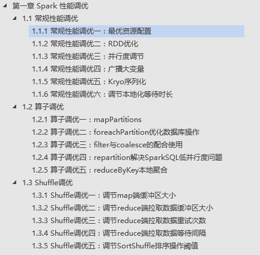{width="2.7909722222222224in"
height="3.2694444444444444in"}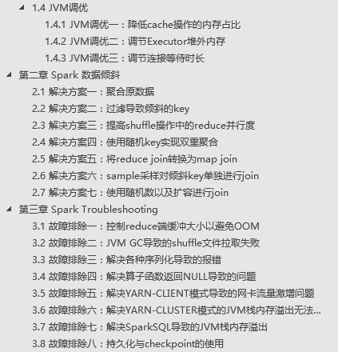{width="2.9125in"
height="3.2708333333333335in"}

8.2 业务经验
------------

### 8.2.1 ODS层采用什么压缩方式和存储格式？

压缩采用Snappy，存储采用orc，压缩比是100g数据压缩完10g左右。

创建分区表，列式存储

### 8.2.2 DWD层做了哪些事？

1）数据清洗

> （1）空值去除
>
> （2）过滤核心字段无意义的数据，比如订单表中订单id为null，支付表中支付id为空
>
> （3）对手机号、身份证号等敏感数据脱敏
>
> （4）对业务数据传过来的表进行维度退化和降维。
>
> （5）将用户行为宽表和业务表进行数据一致性处理
>
> select case when a is null then b else a end as JZR,
>
> \...
>
> from A

2）清洗的手段

Sql、mr、rdd、kettle、Python（项目中采用sql进行清除）

3）清洗掉多少数据算合理

1万条数据清洗掉1条。

### 8.2.3 DWS层做了哪些事？

1）DWS层有3-5张宽表（处理100-200个指标 70%以上的需求）

具体宽表名称：用户行为宽表，用户购买商品明细行为宽表，商品宽表，购物车宽表，物流宽表、登录注册、售后等。

2）哪个宽表最宽？大概有多少个字段？

最宽的是用户行为宽表。大概有60-100个字段

3）具体用户行为宽表字段名称

评论、打赏、收藏、关注\--商品、关注\--人、点赞、分享、好价爆料、文章发布、活跃、签到、补签卡、幸运屋、礼品、金币、电商点击、gmv

> CREATE TABLE \`app\_usr\_interact\`(
>
> \`stat\_dt\` date COMMENT \'互动日期\',
>
> \`user\_id\` string COMMENT \'用户id\',
>
> \`nickname\` string COMMENT \'用户昵称\',
>
> \`register\_date\` string COMMENT \'注册日期\',
>
> \`register\_from\` string COMMENT \'注册来源\',
>
> \`remark\` string COMMENT \'细分渠道\',
>
> \`province\` string COMMENT \'注册省份\',
>
> \`pl\_cnt\` bigint COMMENT \'评论次数\',
>
> \`ds\_cnt\` bigint COMMENT \'打赏次数\',
>
> \`sc\_add\` bigint COMMENT \'添加收藏\',
>
> \`sc\_cancel\` bigint COMMENT \'取消收藏\',
>
> \`gzg\_add\` bigint COMMENT \'关注商品\',
>
> \`gzg\_cancel\` bigint COMMENT \'取消关注商品\',
>
> \`gzp\_add\` bigint COMMENT \'关注人\',
>
> \`gzp\_cancel\` bigint COMMENT \'取消关注人\',
>
> \`buzhi\_cnt\` bigint COMMENT \'点不值次数\',
>
> \`zhi\_cnt\` bigint COMMENT \'点值次数\',
>
> \`zan\_cnt\` bigint COMMENT \'点赞次数\',
>
> \`share\_cnts\` bigint COMMENT \'分享次数\',
>
> \`bl\_cnt\` bigint COMMENT \'爆料数\',
>
> \`fb\_cnt\` bigint COMMENT \'好价发布数\',
>
> \`online\_cnt\` bigint COMMENT \'活跃次数\',
>
> \`checkin\_cnt\` bigint COMMENT \'签到次数\',
>
> \`fix\_checkin\` bigint COMMENT \'补签次数\',
>
> \`house\_point\` bigint COMMENT \'幸运屋金币抽奖次数\',
>
> \`house\_gold\` bigint COMMENT \'幸运屋积分抽奖次数\',
>
> \`pack\_cnt\` bigint COMMENT \'礼品兑换次数\',
>
> \`gold\_add\` bigint COMMENT \'获取金币\',
>
> \`gold\_cancel\` bigint COMMENT \'支出金币\',
>
> \`surplus\_gold\` bigint COMMENT \'剩余金币\',
>
> \`event\` bigint COMMENT \'电商点击次数\',
>
> \`gmv\_amount\` bigint COMMENT \'gmv\',
>
> \`gmv\_sales\` bigint COMMENT \'订单数\')
>
> PARTITIONED BY ( \`dt\` string)

5）商品详情 \-\-\-\-- 购物车 \-\-\-\-- 订单 \-\-\-\-\-- 付款的转换比率

> 5% 50% 80%

6）每天的GMV是多少，哪个商品卖的最好？每天下单量多少？

（1）100万的日活每天大概有10万人购买，平均每人消费100元，一天的GMV在1000万

（2）面膜，每天销售5000个

（3）每天下单量在10万左右

### 8.2.4 分析过哪些指标（一分钟至少说出30个指标）

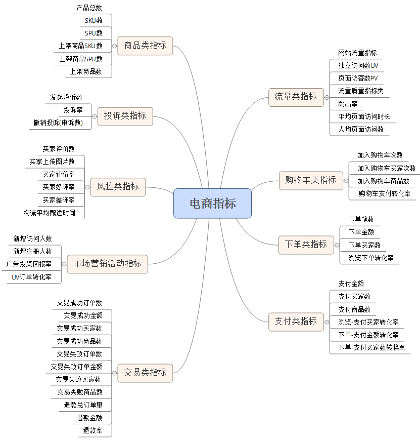{width="5.768055555555556in"
height="6.031944444444444in"}

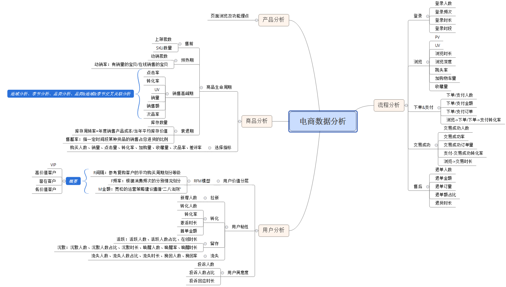{width="5.768055555555556in"
height="3.2736111111111112in"}

日活跃用户，

月活跃用户，

各区域Top10商品统计，

季度商品品类点击率top10，

用户留存，

月APP的用户增长人数，

广告区域点击数top3，

活跃用户每天在线时长，

投诉人数占比，

沉默用户占比，

用户的新鲜度，

商品上架的sku数，

同种品类的交易额排名，

统计买家的评价率，

用户浏览时长，

统计下单的数量，

统计支付的数量，

统计退货的数量，

用户的（日活、月活、周活），

统计流失人数

日活，周活，月活，沉默用户占比，增长人数，活跃用户占比，在线时长统计，歌曲访问数，歌曲访问时长，各地区Top10歌曲统计
,投诉人数占比，投诉回应时长，留存率，月留存率，转化率，GMV，复购vip率，vip人数，歌榜，挽回率，粉丝榜，打赏次数，打赏金额，发布歌曲榜单，歌曲热度榜单，歌手榜单，用户年龄组，vip年龄组占比，收藏数榜单，评论数

1.用户活跃数统计（日活，月活，周活）

2.某段时间的新增用户/活跃用户数

3.页面单跳转化率统计

4.活跃人数占比（占总用户比例）

5.在线时长统计（活跃用户每天在线时长）

12.统计本月的人均在线时长

6.订单产生效率（下单的次数与访问次数比）

7.页面访问时长（单个页面访问时长）

8.统计本季度付款订单

9.统计某广告的区城点击数top3

10.统计本月用户的流失人数

11.统计本月流失人数占用户人数的比例

13.统计本月APP的用户增长人数

14.统计本月的沉默用户

15.统计某时段的登录人数

16.统计本日用户登录的次数平均值

17.统计用户在某类型商品中的浏览深度（页面转跳率）

18.统计用户从下单开始到交易成功的平均时长

19.Top10热门商品的统计

20.统计下单的数量

21.统计支付的数量

22.统计退货的数量

23.统计动销率（有销量的商品/在线销售的宝贝）

24.统计支付转化率

25.统计用户的消费频率

26.统计商品上架的SKU数

27.统计同种品类的交易额排名

28.统计按下单退款排序的top10的商品

29.统计本APP的投诉人数占用户人数的比例

30.用户收藏商品

### 8.2.5 分析过最难的两个指标，现场手写

{width="5.701388888888889in"
height="3.201388888888889in"}

{width="5.701388888888889in"
height="3.201388888888889in"}

### 8.2.6 数据仓库每天跑多少张表，大概什么时候运行，运行多久？

基本一个项目建一个库，表格个数为初始的原始数据表格加上统计结果表格的总数。（一般70-100张表格）

每天0：30开始运行。

所有离线数据报表控制在8小时之内

大数据实时处理部分控制在5分钟之内。

*评分标准：5分*

### 8.2.7 数仓中使用的哪种文件存储格式

常用的包括：textFile，rcFile，ORC，Parquet，一般企业里使用ORC或者Parquet，因为是列式存储，且压缩比非常高，所以相比于textFile，查询速度快，占用硬盘空间少

### 8.2.8 数仓中用到过哪些Shell脚本及具体功能

1）集群启动停止脚本（Hadoop、Flume、Kafka、Zookeeper）

2）Sqoop和数仓之间的导入导出脚本

3）数仓层级之间的数据导入脚本。

### 8.2.9 项目中用过的报表工具

Echarts、kibana、Tableau、Superset、QuickBI

### 8.2.10 测试相关

1）公司有多少台测试服务器？

测试服务器一般三台

2）测试数据哪来的？

一部分自己写Java程序自己造，一部分从生产环境上取一部分。

3）如何保证写的sql正确性

需要造一些特定的测试数据，测试。

离线数据和实时数据分析的结果比较。

4）测试环境什么样？

测试环境的配置是生产的一半

5）测试之后如何上线？

上线的时候，将脚本打包，提交git。先发邮件抄送经理和总监，运维。通过之后跟运维一起上线。

### 8.2.11 项目实际工作流程

以下是**活跃用户**需求的整体开发流程。

**第一步：确定指标的业务口径**

业务口径应该由产品经理主导，找到提出该指标的运营负责人沟通。首先要问清楚**指标是怎么定义的**，比如活跃用户是指启动过APP的用户。

**第二步：确定指标的技术口径**

技术口径是由建模工程师主导，此时产品经理要和模型设计师沟通整个指标的**业务逻辑**，另外就是要协调业务方的技术开发人员和我们的建模工程师一起梳理**需要采集的用户行为，或者业务数据库层面需要用到表结构和字段**。

**第三步：原型设计和评审**

由产品经理主导设计原型，对于活跃主题，我们最终要展示的是**最近n天的活跃用户数变化趋势**
，效果如下图所示。此处需要建模工程师、数据开发工程师、后端开发工程师、前端开发工程师、UI一共参与，一起说明整个功能的价值和详细的操作流程，确保大家理解的一致。

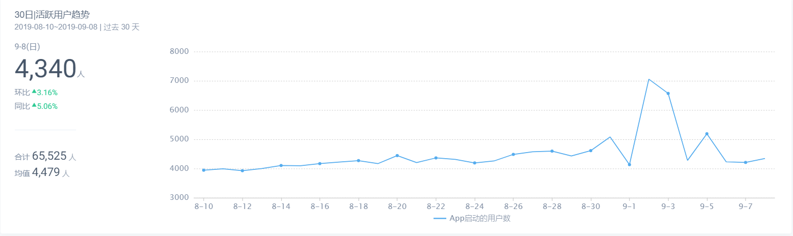{width="5.768055555555556in"
height="1.7236111111111112in"}

**第四步：模型设计**

此时主导的是我们的模型设计工程师，一般会采用分层建模的方式把数据更加科学的组织存储。分为
ODS（操作数据层），DWD(明细数据层)、DWS（汇总数据层）、ADS
（应用数据层），这是业务对数据分层常用的模型。模型设计工程师要清楚的知道数据来源自那里，要怎么存放。

以用户活跃需求为例，ods层需要存放start\_log（启动日志），dwd层需要对数据进行清洗、过滤，dws层需要对数据进行轻度聚合，ads层需要得出最终统计指标的结果。

**第五步：数据开发**

此时主导的是大数据开发工程师，首先要和数据建模工程师沟通好技术口径明确好我们计算的指标都来自于那些业务系统，他们通过数据同步的工具如flume、sqoop等将数据同步到模型工程师设计的ODS层，然后就是一层一层的通过SQL计算到DWD、DWS层，一层一层的汇总，最后形成可为应用直接服务的数据填充到ADS层。

**第六步：后端开发**

此时由后端开发主导，后端开发工程师基于产品经理的功能定义输出相应的接口给前端开发工程师调用，由于ADS层的数据已经由开发工程师导出到常规的关系型数据库（如MYSQL等），此时后端开发工程师更多的是和产品经理沟通产品的功能、性能方面的问题，以便给使用者更好的用户体验。

**第七步：前端开发**

此时主导的是前端开发工程师。原型出来后产品经理会让UI设计师基于产品功能的重点设计UI，UI设计师经过反复的设计，UI最终定型后，会给我们的前端开发工程师提供切图。前端开发工程师基于UI的切图做前端页面的开发。

**第八步：联调**

此时数据开发工程师、前端开发工程师、后端开发工程师都要参与进来。此时会要求大数据开发工程师基于历史的数据执行计算任务，数据开发工程师承担数据准确性的校验。前后端解决用户操作的相关BUG保证不出现低级的问题完成自测。

**第九步：测试**

测试工程师在完成原型评审后就要开始写测试用例，那些是开发人员自己要自测通过才能交上来测试的，那些是自己要再次验证的都在测试用例写清楚。此时有经验的产品经理会向运营人员要历史的统计数据来核对数据，不过运营人员的数据不一定准确，只是拿来参考。最终测试没问题产品经理协调运营人员试用，试用中发现的一些问题再回炉重新修改，此时整个研发过程就结束了。

**第十步：上线**

运维工程师会配合我们的前后端开发工程师更新最新的版本到服务器。此时产品经理要找到该指标的负责人长期跟进指标的准确性。重要的指标还要每过一个周期内部再次验证，从而保证数据的准确性。

### 8.2.12 项目中实现一个需求大概多长时间

刚入职第一个需求大概需要7天左右。

对业务熟悉后，平均一天一个需求。

影响时间的因素：开会讨论需求、表的权限申请、测试等

### 8.2.13 项目在3年内迭代次数，每一个项目具体是如何迭代的。

差不多一个月会迭代一次。就产品或我们提出优化需求，然后评估时间。每周我们都会开会做下周计划和本周总结。

有时候也会去预研一些新技术。

### 8.2.14 项目开发中每天做什么事

新需求比如埋点或是报表来了之后，需要设计做的方案，设计完成之后跟产品讨论，再开发。

数仓的任何步骤出现问题，需要查看问题，比如日活，月活下降等。

第9章 电商运营经验
==================

9.1 电商指标整理
----------------

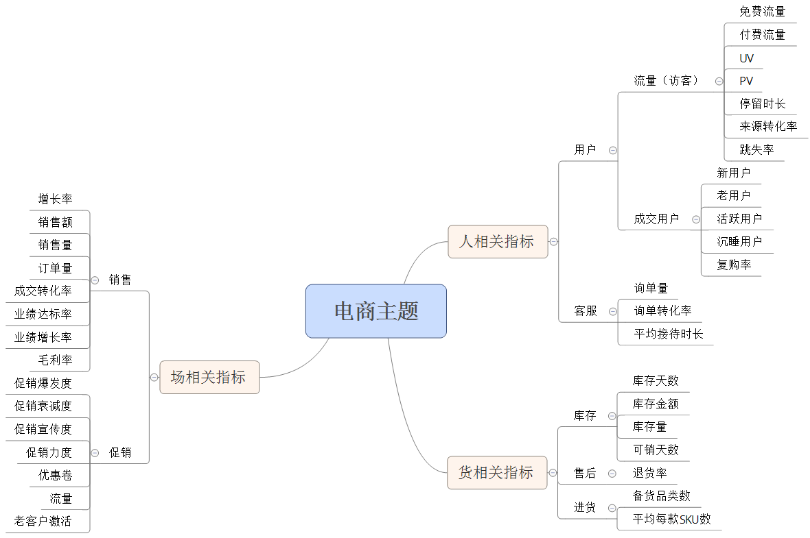{width="5.768055555555556in"
height="3.8375in"}

现在的电子商务：

1、大多买家通过搜索找到所买物品，而非电商网站的内部导航，搜索关键字更为重要；

2、电商商家通过推荐引擎来预测买家可能需要的商品。推荐引擎以历史上具有类似购买记录的买家数据以及用户自身的购买记录为基础，向用户提供推荐信息；

3、电商商家时刻优化网站性能，如A/B
Test划分来访流量，并区别对待来源不同的访客，进而找到最优的产品、内容和价格；

4、购买流程早在买家访问网站前，即在社交网络、邮件以及在线社区中便已开始，即长漏斗流程（以一条推文、一段视频或一个链接开始，以购买交易结束）。

相关数据指标：关键词和搜索词、推荐接受率、邮件列表/短信链接点入率

9.2 电商8类基本指标
-------------------

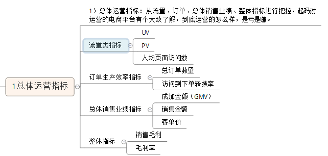{width="5.768055555555556in"
height="2.7493055555555554in"}

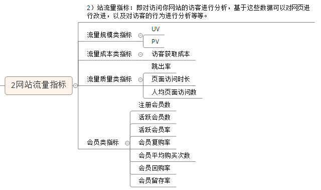{width="5.768055555555556in"
height="3.4069444444444446in"}

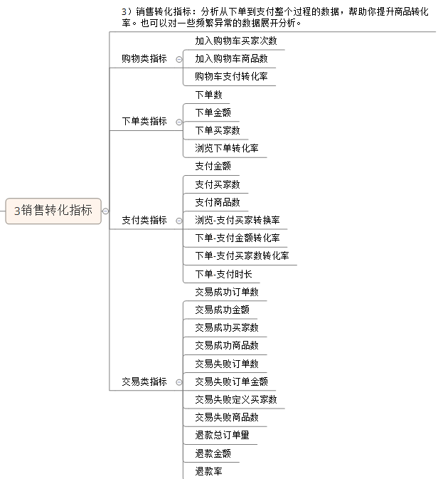{width="5.768055555555556in"
height="6.302083333333333in"}

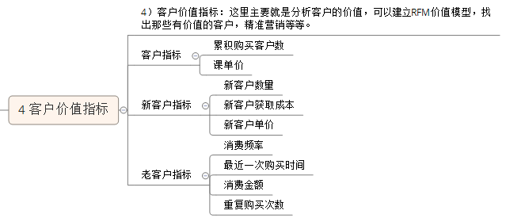{width="5.768055555555556in"
height="2.482638888888889in"}

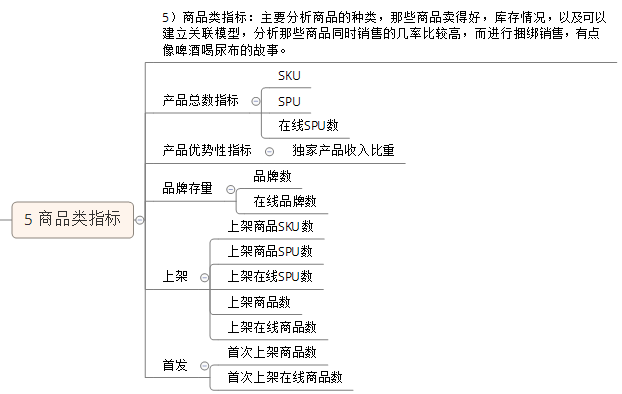{width="5.768055555555556in"
height="3.6527777777777777in"}

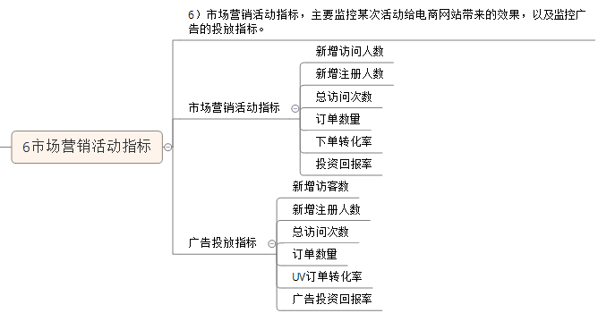{width="5.768055555555556in"
height="3.022222222222222in"}

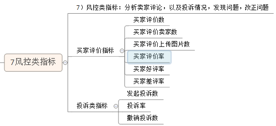{width="5.768055555555556in"
height="2.638888888888889in"}

8）市场竞争指标：主要分析市场份额以及网站排名，进一步进行调整

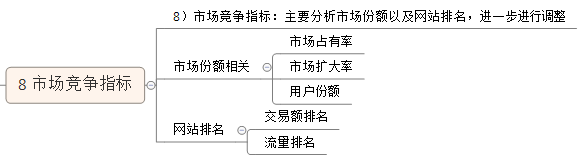{width="5.768055555555556in"
height="1.6423611111111112in"}

9.3 五大关键电商指标和三个思路
------------------------------

现今电商发展的十分火热，而很多电商的运营团队缺少精细化运营和数据驱动的经验和意识，但是电商运营正在成为电商自身增长越来越重要的因素。做为一个电商人该关注、分析哪些电商数据呢。

电商平台数据的分析，主要关注的五大关键数据指标：活跃用户量、转化、留存、复购、GMV；三个关键思路：商品运营、用户运营、产品运营。

{width="4.777777777777778in"
height="2.548611111111111in"}

**五大数据指标**

在众多的互联网细分行业中，电商行业起步早，发展时间长，行业特征显著：

1）商品品类及SKU多，用户覆盖面广，运营难度大；

2）总体上客单价低（除旅游、奢侈品等外），强调留存与复购；

3）电商产品设计相对的成熟，重中之重是优化运营；

4）电商行业竞争的白热化，精细化运营是冲出重围的必备技能。

要想实现精细化运营，数据是必不可少的一个环节。电商网站要提高运营效率，至少需要五大关键指标：活跃用户量、转化率、留存、复购和
GMV 。

1）活跃用户量是一个基本的指标，有 DAU（日活跃用户）、WAU（周活跃用户）和
MAU（月活跃用户）三个层次；

2）转化是一个非常重要的指标，电商运营需要关注主路径、次路径甚至精细到每一个品类
/ SKU 的转化率；

3）留存要从不同的时间周期上研究，包括次日留存率、3 日、7 日、30 日留存；

4）复购则要从 3 个角度去看，复购用户量、复购率和复购金额比；

5）GMV是最重要的指标，我们的运营最终是围绕这个来进行的。GMV = UV
\*转化率\*客单价。

**三条思路**

{width="4.410416666666666in"
height="1.5305555555555554in"}

商品运营

前面提到电商行业的一大特点是商品品类或者 SKU
非常多，那么如此多的商品该如何运营呢？

{width="4.7444444444444445in"
height="2.5444444444444443in"}

这是三个电商APP的首页界面（各家Web端布局也比较相似）：前两个是京东和国美，属于平台型的电商；第三个是生鲜水果平台，属于垂直型电商。不难发现电商的产品在设计上非常类似，首页上面呈现的是轮播的Banner
，下面是活动专区。

在商品运营中，尤其是首页商品更新速度快，我们要格外重视转化，甚至要精确到不同时间区间、不同位置、不同商品的转化率。然后根据转化率，结合业务经验，不断调整运营策略。然而目前，即使是大型的电商网站，也没有很好地做到这一点，对于每个商品品类
/ SKU的转化率的分析仍存在一定的空缺。

商品运营有一个非常大的优势：投入低，见效快，效果明显，商品运营的本质是通过不同坑位、不同活动、不同商品的分析来提高我们的转化率和GMV
。

下图展示了一个电商购买流程的主路径：首页------活动页------商品详情页------支付完成。从精细化分析的角度出发，我们关注转化路径每一步的转化率；通过分析不难发现最后一步"支付完成"的转化率偏低。

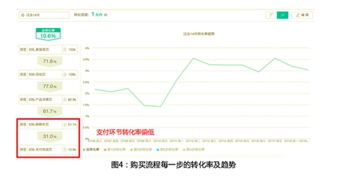{width="5.259027777777778in"
height="2.8958333333333335in"}

我们更需要基于三个关键转化"UV-点击"、"点击-加入购物车"、"购物车-支付成功"，对不同的商品进行比较分析，从而及时调整运营策略，下图就是各个步骤的转化率：

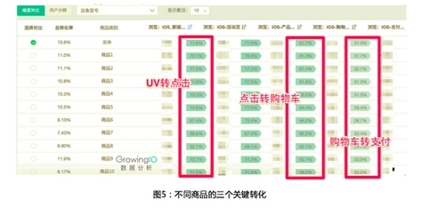{width="4.680555555555555in"
height="2.4375in"}

电商网站的运营节奏非常快，尤其是活动专区的"秒杀"、"抢购"等活动，需要实时监测
SKU
的更新变化。上图中，某电商平台进行了一次微信上的促销活动，通过实时监测到对应的平台访问情况，便于运营人员及时调整运营策略。

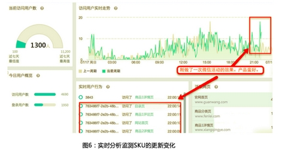{width="4.715277777777778in"
height="2.625in"}

用户运营

正如开头提到的，随着互联网用户增长速度的放缓，用户体验愈发重要，之前无目的的短信推送、APP
通知有可能使用户厌烦，破坏用户的体验；甚至可能导致用户退订、卸载。精细化运营的情况下，做好用户运营主要从两个角度出发：一是找到用户留存的关键点；二是采取差异化的运营策略，区分不同的用户群体，对不同群体采取差异化的运营方式。

1\. 找到用户增长的"魔法数字"

留住一个客户的成本远远小于重新获取一个客户的成本，所以留存至关重要，它关系着一个平台能否持续健康发展。

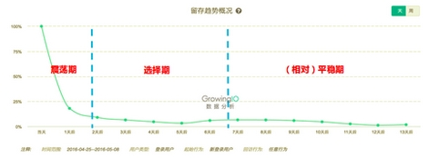{width="4.777777777777778in"
height="1.8125in"}

留存曲线分成三个周期，开始是震荡期和选择期，经过这两个周期，如果用户能够留下来，就会进入一个相对平稳期。
在硅谷流向的 growth hacking 中，经常提到 magic
number（魔法数字）。那么作为一个电商平台，你的平台的魔法数字是什么？

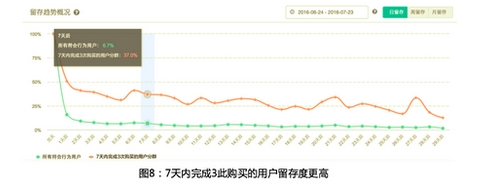{width="4.5625in"
height="1.9166666666666667in"}

以某电商平台为例，在该网站上 7 天内完成 3
次购买的用户的留存度（红色）是一般用户（绿色）的 4
倍左右，因此在一周内让用户完成 3 次购买就是他的魔法数字。

2\. 差异化的运营策略

不同用户的活跃度、商品偏好、购买决策阶段都各异，我们需要采取差异化的运营策略。差异化的运营策略主要从3个角度出发：基于用户的活跃度、基于用户对不同商品的偏好、基于用户所处的决策阶段。

基于用户的活跃程度，我们可以将用户大致分成"流失用户"、"低频活跃用户"和"高频活跃用户"。一般情况下，一个用户
30
天甚至更久没有登录你的平台，我们基本可以认为该用户流失了。对于流失客户，是否要考虑采取召回策略。30
天内活跃 10 天以上的高度活跃用户，我们是否可以向其推荐更多精准的商品。

其次基于用户对不同商品的偏好，我们采用用户分群，将用户区分成"美妆类"、"鞋帽类"、"数码类"、"书籍类"等不同群体，然后精准推送新品。

最后，基于用户购买决策的不同阶段。一个标准的购买流程，先后经历"首页浏览/搜索------浏览商品详情页------商品对比------加入购物车------支付成功"等几个环节，用户在每一个节点都处于不同的决策阶段。我们从维度（属性数据）和指标（行为数据）出发，对用户分群，如"领取了优惠券，但是未使用"的用户，采取精准的推送。我们从
GrowingIO 提供的 API 导出这些用户的 ID 和属性，然后对接企业内容的 CRM
或者 EDM 进行精准的推送和提醒，刺激用户的转化。

产品运营

目前电商产品的设计总体成熟、界面布局类似，我们主要结合用户的使用情况去优化产品。我们的思路主要是：优化产品不同路径的转化率，注重用户点评的管理。

1\. 优化产品，从转化做起

一个购买行为可能有多种转化路径：

1）首页------商品------订单转化

2）首页------商品列表------详情页------订单转化

3）首页------搜索------商品列表------详情页------订单转化

4）首页------单坑位Banner------活动页------详情页------订单转化

除了不同路径的转化率，我们还关注转化的每一步：

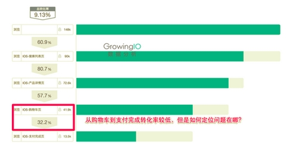{width="4.770833333333333in"
height="2.4652777777777777in"}

上图利用
GrowingIO漏斗功能展示了一个用户的购买流程及每一步的转化率，我们发现"加入购物车"到"支付成功"的转化率不到
1/3，偏低，需要排查具体的问题出在哪里。

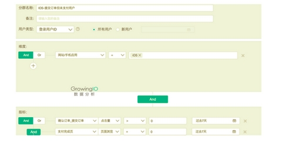{width="4.429861111111111in"
height="2.4652777777777777in"}

一旦觉察到问题可能存在，我们就需要层层下钻，直接抵达问题的核心。我们通过用户分群，将"提交订单，但是未支付完成"的用户全部筛选出来。然后抽出
3-5
个符合条件的用户，借助"用户细查"仔细观看每个用户的操作流程，一般就能发现问题了。

2\. 用户评价的重要性

越注重用户体验的商品，用户评价的管理就越重要，例如旅游类商品、生鲜类商品、鞋服类商品等。

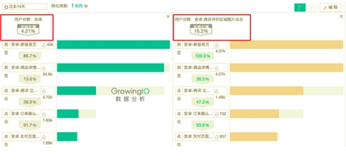{width="5.076388888888889in"
height="2.201388888888889in"}

借助转化漏斗，我们发现观看过"商品评价图片"的用户的购买转化率是一般用户的4
倍，但是其数量只占总体的1/10。如果我们能引导用户参与点评，将优质点评展示给更多的新用户，那么我们的总体购买转化率将会有更大的提升。

9.4 电商运营数据挖掘
--------------------

其实你可以问自己这样一个问题，是否真正了解你的客户在哪里？他们是什么样的一群人？

1）你店铺的消费人群年龄层是多少？

不要说是青年人，是中年人，是学生，是女性等等，你需要详细的分类，年轻人是多少岁？

2）你店铺的主要消费群体在哪里？

广东？浙江？还是北京？这个答案也是太泛，那是哪个市区的占比比较大，为什么会有这样的情况？

3）你店铺的消费人群的消费能力是在多少？一个月的网购消费能力有多少？

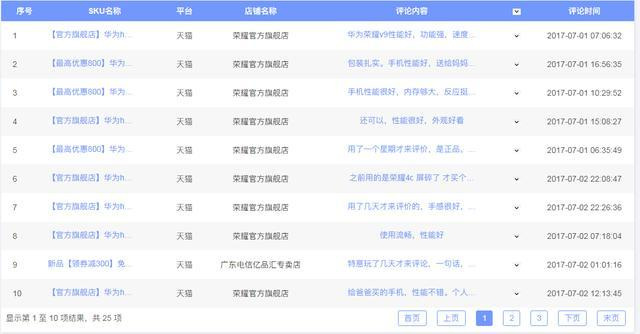{width="5.768055555555556in"
height="3.0097222222222224in"}

某电商平台冰箱销售数据

4）你的主体消费者消费观念是怎样？要知道消费的观念决定了他的真正消费能力与消费频率。

5）你的消费者对你的产品有哪些需求点？

6）你的产品有没有按照消费者的需求点进行展示？

7）如果是做服饰的你消费人群消费占比最大的是什么尺码？

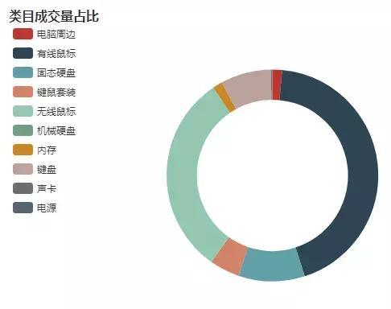{width="3.861111111111111in"
height="2.8777777777777778in"}

某电商平台电子类销售数据

**大数据应用，其真正的核心在于挖掘数据中蕴藏的情报价值，而不是简单的数据计算。**

**作用一：商品关联进行的挖掘营销**

利用小型的数据库进行处理和分析，能够使得用户的短期需求得到满足。

**利用大数据的分析，保证充分对于商品的关联性进行挖掘，并能能够保证推荐界面的有效性**，这点则是电商应该注重的地方。

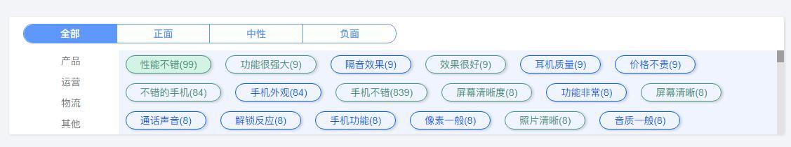{width="5.768055555555556in"
height="1.075in"}

某电商平台评论分析

**作用二：社会网络营销**

在相关的社会媒介上进行分享活动的积极开展，使得传播范围不断扩大，有效提高营销效率。

**作用三：地理营销**

根据地理位置区域特定区域中人们的不同喜好，因此有效地开展不同类型的营销策略活动。

根据电商交易最后环节获得用户的收货地址，只有部分的电商则会有效地在开始阶段，就能够获得用户地理位置，这样的情况不利于进行商品的地理销售。

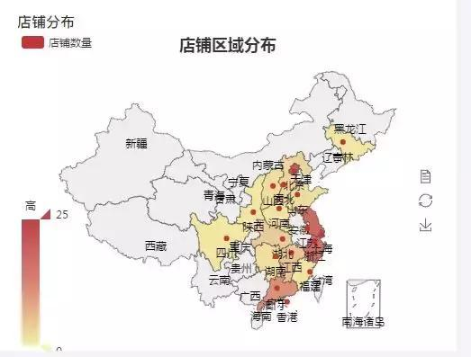{width="3.4097222222222223in"
height="2.8569444444444443in"}

某品牌店铺地区分布

**作用四：用户行为的分析营销**

电商企业应该**根据用户的个性化要求来进行商品的推荐活动。**

以及产品分类等，能够积极邀请用户对于感兴趣商品进行关注，之后还能够继续进行**个性化信息的添加和推荐**。

1）总体运营指标

从流量、订单、总体销售业绩、整体指标进行把控，起码对运营的电商平台有个大致了解，到底运营的怎么样，是亏是赚。

2）网站流量指标

即对访问你网站的访客进行分析，基于这些数据可以对网页进行改进，以及对访客的行为进行分析等等。

3）销售转化指标

分析从下单到支付整个过程的数据，帮助你提升商品转化率。

也可以对一些频繁异常的数据展开分析。

分析指标包括：订单编号、订购时间、商品编号、商品名称、订单价格、订单数量、订单状态比率、支付方式统计、支付方式订单比率、订单数top10排名、订单金额top10排名、取消订单数、新会员订购比率、老会员订购比率、订单各区分布等。

4）客户价值指标

这里主要就是分析客户的价值，可以建立RFM价值模型，找出那些有价值的客户，精准营销等等，每年注册的用户最后一次下单的时间分布。

5）商品类指标

分析电商网站商品一级/二级/三级的商品分类、商品品牌、当商品以及商品活动数据分析，帮助电商网站评估商品销售情况及变化趋势。

哪些商品卖得好，库存情况，以及可以建立关联模型，分析那些商品同时销售的几率比较高，从而进行捆绑销售。

6）市场营销活动指标

主要监控某次活动给电商网站带来的效果，以及监控广告的投放指标。

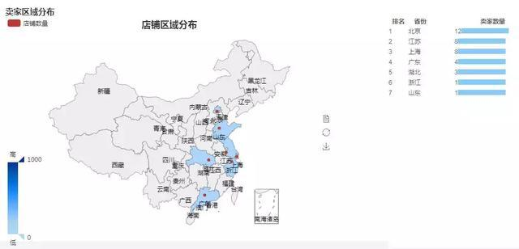{width="4.986111111111111in"
height="2.438888888888889in"}

某品牌商铺分布

同时营销流量订单转化分析能够对细分后的购买及购买率与细分前的总访客数实时分析对比。

能够帮您分析了解到从哪个站点进入的客户对销售的贡献高低，以便帮助我们及时调整优化网站布局。

7）风控类指标

分析卖家评论，以及投诉情况，发现问题，改正问题

8）市场竞争指标

主要分析市场份额以及网站排名，进一步进行调整

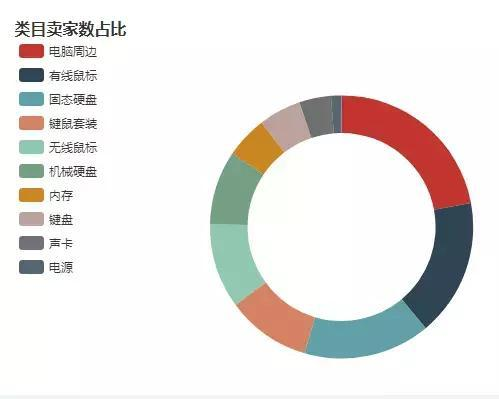{width="3.923611111111111in"
height="2.9368055555555554in"}

某电商电子类目数据

以上8个方面来阐述如何对电商平台进行数据分析，当然，具体问题具体分析，每个平台的侧重点也有所差异，所以如何分析还需因地制宜。

9.5 直播指标
------------

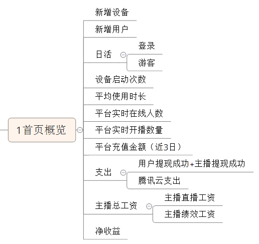{width="3.7729166666666667in"
height="3.561111111111111in"}

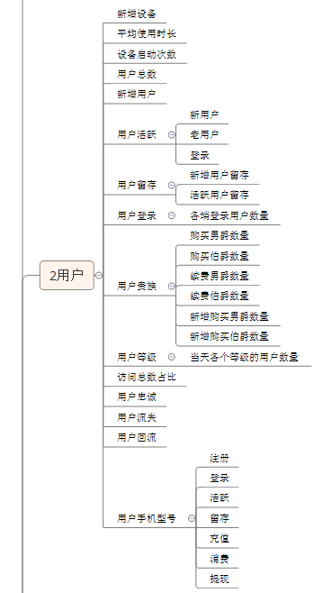{width="3.7395833333333335in"
height="6.854166666666667in"}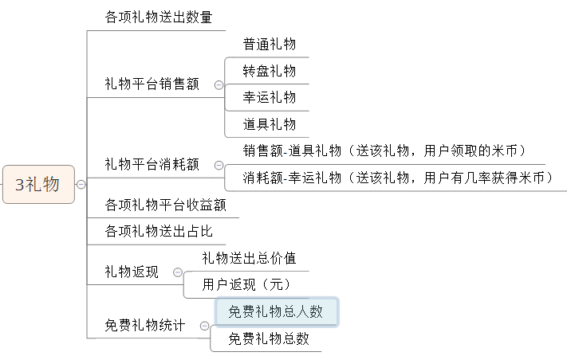{width="5.768055555555556in"
height="3.626388888888889in"}

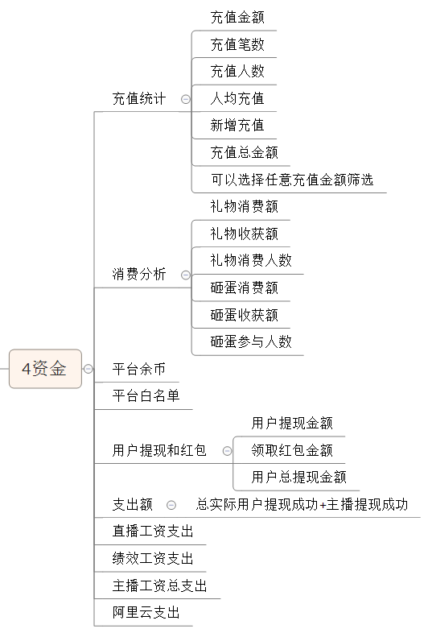{width="4.377083333333333in"
height="6.40625in"}

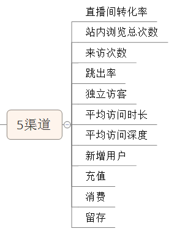{width="2.4923611111111112in"
height="3.1527777777777777in"}

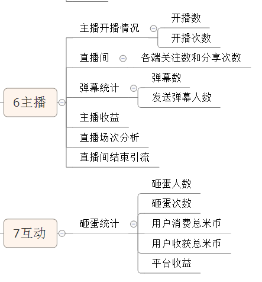{width="3.31875in"
height="3.4770833333333333in"}

第10章 JavaSE（答案精简）
=========================

10.1 HhashMap底层源码，数据结构
-------------------------------

hashMap的底层结构在jdk1.7中由数组+链表实现，在jdk1.8中由数组+链表+红黑树实现，以数组+链表的结构为例。

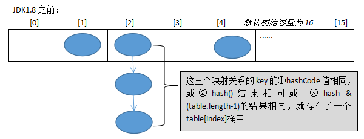{width="5.761805555555555in"
height="2.2090277777777776in"}

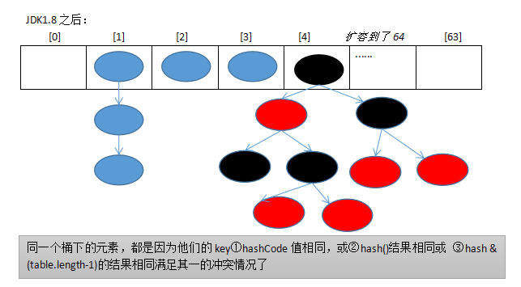{width="5.7659722222222225in"
height="3.183333333333333in"}

**JDK1.8之前Put方法：**

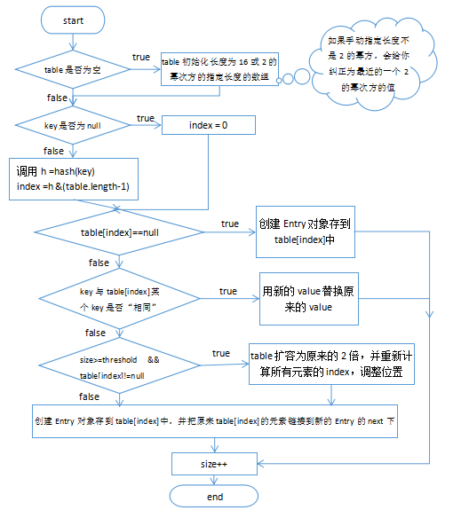{width="5.405555555555556in"
height="5.988888888888889in"}

**JDK1.8之后Put方法：**

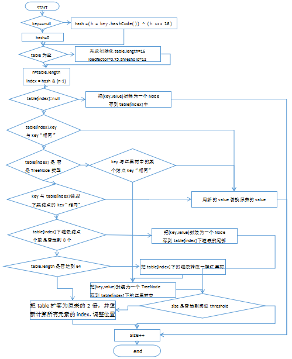{width="5.708333333333333in"
height="7.023611111111111in"}

10.2 Java自带哪几种线程池？
---------------------------

> **1）newCachedThreadPool**

创建一个可缓存线程池，如果线程池长度超过处理需要，可灵活回收空闲线程，若无可回收，则新建线程。这种类型的线程池特点是：

工作线程的创建数量几乎没有限制（其实也有限制的，数目为Interger.
MAX\_VALUE）, 这样可灵活的往线程池中添加线程。

如果长时间没有往线程池中提交任务，即如果工作线程空闲了指定的时间（默认为1分钟），则该工作线程将自动终止。终止后，如果你又提交了新的任务，则线程池重新创建一个工作线程。

在使用CachedThreadPool时，一定要注意控制任务的数量，否则，由于大量线程同时运行，很有会造成系统瘫痪。

> **2）newFixedThreadPool**

创建一个指定工作线程数量的线程池。每当提交一个任务就创建一个工作线程，如果工作线程数量达到线程池初始的最大数，则将提交的任务存入到池队列中。FixedThreadPool是一个典型且优秀的线程池，它具有线程池提高程序效率和节省创建线程时所耗的开销的优点。但是，在线程池空闲时，即线程池中没有可运行任务时，它不会释放工作线程，还会占用一定的系统资源。

> **3）newSingleThreadExecutor**

创建一个单线程化的Executor，即只创建唯一的工作者线程来执行任务，它只会用唯一的工作线程来执行任务，保证所有任务按照指定顺序（FIFO,
LIFO,
优先级）执行。如果这个线程异常结束，会有另一个取代它，保证顺序执行。单工作线程最大的特点是可保证顺序地执行各个任务，并且在任意给定的时间不会有多个线程是活动的。

> **4）newScheduleThreadPool**

创建一个定长的线程池，而且支持定时的以及周期性的任务执行，支持定时及周期性任务执行。延迟3秒执行。

10.3 HashMap和HashTable区别
---------------------------

1)  线程安全性不同

HashMap是线程不安全的，HashTable是线程安全的，其中的方法是Synchronize的，在多线程并发的情况下，可以直接使用HashTabl，但是使用HashMap时必须自己增加同步处理。

2)  是否提供contains方法

HashMap只有containsValue和containsKey方法；HashTable有contains、containsKey和containsValue三个方法，其中contains和containsValue方法功能相同。

3)  key和value是否允许null值

Hashtable中，key和value都不允许出现null值。HashMap中，null可以作为键，这样的键只有一个；可以有一个或多个键所对应的值为null。

4)  数组初始化和扩容机制

 HashTable在不指定容量的情况下的默认容量为11，而HashMap为16，Hashtable不要求底层数组的容量一定要为2的整数次幂，而HashMap则要求一定为2的整数次幂。

 Hashtable扩容时，将容量变为原来的2倍加1，而HashMap扩容时，将容量变为原来的2倍。

10.4 TreeSet和HashSet区别
-------------------------

HashSet是采用hash表来实现的。其中的元素没有按顺序排列，add()、remove()以及contains()等方法都是复杂度为O(1)的方法。

TreeSet是采用树结构实现（红黑树算法）。元素是按顺序进行排列，但是add()、remove()以及contains()等方法都是复杂度为O(log
(n))的方法。它还提供了一些方法来处理排序的set，如first()，last()，headSet()，tailSet()等等。

10.5 String buffer和String build区别
------------------------------------

1、StringBuffer与StringBuilder中的方法和功能完全是等价的。

2、只是StringBuffer中的方法大都采用了 synchronized 关键字进行修饰，因此是线程安全的，而StringBuilder没有这个修饰，可以被认为是线程不安全的。 

3、在单线程程序下，StringBuilder效率更快，因为它不需要加锁，不具备多线程安全而StringBuffer则每次都需要判断锁，效率相对更低

10.6 Final、Finally、Finalize
-----------------------------

final：修饰符（关键字）有三种用法：修饰类、变量和方法。修饰类时，意味着它不能再派生出新的子类，即不能被继承，因此它和abstract是反义词。修饰变量时，该变量使用中不被改变，必须在声明时给定初值，在引用中只能读取不可修改，即为常量。修饰方法时，也同样只能使用，不能在子类中被重写。

finally：通常放在try...catch的后面构造最终执行代码块，这就意味着程序无论正常执行还是发生异常，这里的代码只要JVM不关闭都能执行，可以将释放外部资源的代码写在finally块中。

finalize：Object类中定义的方法，Java中允许使用finalize()
方法在垃圾收集器将对象从内存中清除出去之前做必要的清理工作。这个方法是由垃圾收集器在销毁对象时调用的，通过重写finalize()
方法可以整理系统资源或者执行其他清理工作。

10.7 ==和Equals区别
-------------------

 == : 如果比较的是基本数据类型，那么比较的是变量的值

如果比较的是引用数据类型，那么比较的是地址值（两个对象是否指向同一块内存）

 equals:如果没重写equals方法比较的是两个对象的地址值。

 如果重写了equals方法后我们往往比较的是对象中的属性的内容

equals方法是从Object类中继承的，默认的实现就是使用==

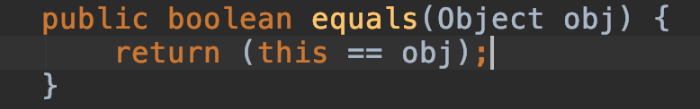{width="4.454861111111111in"
height="0.6979166666666666in"}

第11章 Redis（答案精简）
========================

11.1 缓存穿透、缓存雪崩、缓存击穿
---------------------------------

1）缓存穿透是指查询一个一定不存在的数据。由于缓存命不中时会去查询数据库，查不到数据则不写入缓存，这将导致这个不存在的数据每次请求都要到数据库去查询，造成缓存穿透。

解决方案：

1.  是将空对象也缓存起来，并给它设置一个很短的过期时间，最长不超过5分钟

②
采用布隆过滤器，将所有可能存在的数据哈希到一个足够大的bitmap中，一个一定不存在的数据会被这个bitmap拦截掉，从而避免了对底层存储系统的查询压力

2）如果缓存集中在一段时间内失效，发生大量的缓存穿透，所有的查询都落在数据库上，就会造成缓存雪崩。

解决方案：

尽量让失效的时间点不分布在同一个时间点

3）缓存击穿，是指一个key非常热点，在不停的扛着大并发，当这个key在失效的瞬间，持续的大并发就穿破缓存，直接请求数据库，就像在一个屏障上凿开了一个洞。

解决方案：

可以设置key永不过期

11.2 哨兵模式
-------------

主从复制中反客为主的自动版，如果主机Down掉，哨兵会从从机中选择一台作为主机，并将它设置为其他从机的主机，而且如果原来的主机再次启动的话也会成为从机。

11.3 数据类型
-------------

  ------------------- ----------------------------
  string              字符串
  list                可以重复的集合
  set                 不可以重复的集合
  hash                类似于Map\<String,String\>
  zset(sorted set）   带分数的set
  ------------------- ----------------------------

11.4 持久化
-----------

**1）RDB持久化：**

1.  **在指定的时间间隔内持久化**

2.  **服务shutdown会自动持久化**

**③ 输入bgsave也会持久化**

**2）AOF : 以日志形式记录每个更新操作**

Redis重新启动时读取这个文件，重新执行新建、修改数据的命令恢复数据。

**保存策略：**

推荐（并且也是默认）的措施为每秒持久化一次，这种策略可以兼顾速度和安全性。

**缺点：**

1 比起RDB占用更多的磁盘空间

2 恢复备份速度要慢

3 每次读写都同步的话，有一定的性能压力

4 存在个别Bug，造成恢复不能

**选择策略：**

官方推荐：

如果对数据不敏感，可以选单独用RDB；不建议单独用AOF，因为可能出现Bug;如果只是做纯内存缓存，可以都不用

11.5 悲观锁
-----------

执行操作前假设当前的操作肯定（或有很大几率）会被打断（悲观）。基于这个假设，我们在做操作前就会把相关资源锁定，不允许自己执行期间有其他操作干扰。

11.6 乐观锁
-----------

执行操作前假设当前操作不会被打断（乐观）。基于这个假设，我们在做操作前不会锁定资源，万一发生了其他操作的干扰，那么本次操作将被放弃。Redis使用的就是乐观锁。

第12章 MySql
============

12.1 MyISAM与InnoDB的区别
-------------------------

+------------+---------------------------+---------------------------+
| **对比项** | **MyISAM**                | **InnoDB**                |
+------------+---------------------------+---------------------------+
| **外键**   | **不支持**                | **支持**                  |
+------------+---------------------------+---------------------------+
| **事务**   | **不支持**                | **支持**                  |
+------------+---------------------------+---------------------------+
| **行表锁** | **表锁，即使              | **行锁,操作时只锁某一     |
|            | 操作一条记录也会锁住整个  | 行，不对其它行有影响，**  |
|            | 表，不适合高并发的操作**  |                           |
|            |                           | **适合高并发的操作**      |
+------------+---------------------------+---------------------------+
| **缓存**   | **只缓                    | **不仅缓存                |
|            | 存索引，不缓存真实数据**  | 索引还要缓存真实数据，对  |
|            |                           | 内存要求较高，而且内存大  |
|            |                           | 小对性能有决定性的影响**  |
+------------+---------------------------+---------------------------+

12.2 索引
---------

**数据结构：B+Tree**

一般来说能够达到range就可以算是优化了 idx name\_deptId

**口诀（两个法则加6种索引失效的情况）**

全值匹配我最爱，最左前缀要遵守；

带头大哥不能死，中间兄弟不能断；

索引列上少计算，范围之后全失效；

LIKE百分写最右，覆盖索引不写\*；

不等空值还有OR，索引影响要注意；

VAR引号不可丢，SQL优化有诀窍。

12.3 b-tree和b+tree的区别
-------------------------

1\) B-树的关键字、索引和记录是放在一起的，
B+树的非叶子节点中只有关键字和指向下一个节点的索引，记录只放在叶子节点中。

2\)
在B-树中，越靠近根节点的记录查找时间越快，只要找到关键字即可确定记录的存在；而B+树中每个记录的查找时间基本是一样的，都需要从根节点走到叶子节点，而且在叶子节点中还要再比较关键字。

12.4 redis是单线程的，为什么那么快
----------------------------------

1)完全基于内存，绝大部分请求是纯粹的内存操作，非常快速。

2)数据结构简单，对数据操作也简单，Redis中的数据结构是专门进行设计的

3)采用单线程，避免了不必要的上下文切换和竞争条件，也不存在多进程或者多线程导致的切换而消耗
CPU，不用去考虑各种锁的问题，不存在加锁释放锁操作，没有因为可能出现死锁而导致的性能消耗

4)使用多路I/O复用模型，非阻塞IO

5)使用底层模型不同，它们之间底层实现方式以及与客户端之间通信的应用协议不一样，Redis直接自己构建了VM
机制 ，因为一般的系统调用系统函数的话，会浪费一定的时间去移动和请求

12.5 MySQL的事务
----------------

**一、事务的基本要素（ACID）**

1、原子性（Atomicity）：事务开始后所有操作，要么全部做完，要么全部不做，不可能停滞在中间环节。事务执行过程中出错，会回滚到事务开始前的状态，所有的操作就像没有发生一样。也就是说事务是一个不可分割的整体，就像化学中学过的原子，是物质构成的基本单位

2、一致性（Consistency）：事务开始前和结束后，数据库的完整性约束没有被破坏
。比如A向B转账，不可能A扣了钱，B却没收到。

3、隔离性（Isolation）：同一时间，只允许一个事务请求同一数据，不同的事务之间彼此没有任何干扰。比如A正在从一张银行卡中取钱，在A取钱的过程结束前，B不能向这张卡转账。

4、持久性（Durability）：事务完成后，事务对数据库的所有更新将被保存到数据库，不能回滚。

**二、事务的并发问题**

1、脏读：事务A读取了事务B更新的数据，然后B回滚操作，那么A读取到的数据是脏数据

2、不可重复读：事务 A 多次读取同一数据，事务 B
在事务A多次读取的过程中，对数据作了更新并提交，导致事务A多次读取同一数据时，结果
不一致

3、幻读：系统管理员A将数据库中所有学生的成绩从具体分数改为ABCDE等级，但是系统管理员B就在这个时候插入了一条具体分数的记录，当系统管理员A改结束后发现还有一条记录没有改过来，就好像发生了幻觉一样，这就叫幻读。

小结：不可重复读的和幻读很容易混淆，不可重复读侧重于修改，幻读侧重于新增或删除。解决不可重复读的问题只需锁住满足条件的行，解决幻读需要锁表

**三、MySQL事务隔离级别**

事务隔离级别 脏读 不可重复读 幻读

读未提交（read-uncommitted） 是 是 是

不可重复读（read-committed） 否 是 是

可重复读（repeatable-read） 否 否 是

串行化（serializable） 否 否 否

第13章 JVM
==========

13.1 JVM内存分哪几个区，每个区的作用是什么?
-------------------------------------------

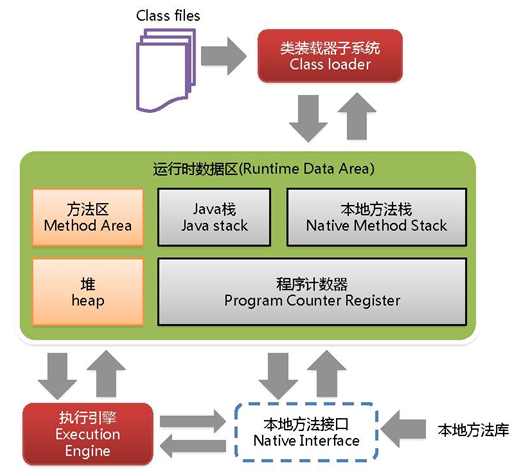{width="5.458333333333333in"
height="4.927083333333333in"}

java虚拟机主要分为以下几个区:

1)  **方法区**：

```{=html}
<!-- -->
```
a.  有时候也成为永久代，在该区内很少发生垃圾回收，但是并不代表不发生GC，在这里进行的GC主要是对方法区里的常量池和对类型的卸载

b.  方法区主要用来存储已被虚拟机加载的类的信息、常量、静态变量和即时编译器编译后的代码等数据。

c.  该区域是被线程共享的。

d.  方法区里有一个运行时常量池，用于存放静态编译产生的字面量和符号引用。该常量池具有动态性，也就是说常量并不一定是编译时确定，运行时生成的常量也会存在这个常量池中。

```{=html}
<!-- -->
```
2)  **虚拟机栈**:

```{=html}
<!-- -->
```
a.  虚拟机栈也就是我们平常所称的栈内存,它为java方法服务，每个方法在执行的时候都会创建一个栈帧，用于存储局部变量表、操作数栈、动态链接和方法出口等信息。

b.  虚拟机栈是线程私有的，它的生命周期与线程相同。

c.  局部变量表里存储的是基本数据类型、returnAddress类型（指向一条字节码指令的地址）和对象引用，这个对象引用有可能是指向对象起始地址的一个指针，也有可能是代表对象的句柄或者与对象相关联的位置。局部变量所需的内存空间在编译器间确定

d.  操作数栈的作用主要用来存储运算结果以及运算的操作数，它不同于局部变量表通过索引来访问，而是压栈和出栈的方式

e.  每个栈帧都包含一个指向运行时常量池中该栈帧所属方法的引用，持有这个引用是为了支持方法调用过程中的动态连接.动态链接就是将常量池中的符号引用在运行期转化为直接引用。

```{=html}
<!-- -->
```
3)  **本地方法栈**：\
    本地方法栈和虚拟机栈类似，只不过本地方法栈为Native方法服务。

4)  **堆**：

java堆是所有线程所共享的一块内存，在虚拟机启动时创建，几乎所有的对象实例都在这里创建，因此该区域经常发生垃圾回收操作。

5)  **程序计数器：**

内存空间小，字节码解释器工作时通过改变这个计数值可以选取下一条需要执行的字节码指令，分支、循环、跳转、异常处理和线程恢复等功能都需要依赖这个计数器完成。该内存区域是唯一一个java虚拟机规范没有规定任何OOM情况的区域。

13.2 Java类加载过程?
--------------------

Java类加载需要经历一下几个过程：

1)  加载

加载时类加载的第一个过程，在这个阶段，将完成一下三件事情：

a.  通过一个类的全限定名获取该类的二进制流。

b.  将该二进制流中的静态存储结构转化为方法去运行时数据结构。 

c.  在内存中生成该类的Class对象，作为该类的数据访问入口。

```{=html}
<!-- -->
```
2)  验证

验证的目的是为了确保Class文件的字节流中的信息不回危害到虚拟机.在该阶段主要完成以下四钟验证:

a.  文件格式验证：验证字节流是否符合Class文件的规范，如主次版本号是否在当前虚拟机范围内，常量池中的常量是否有不被支持的类型.

b.  元数据验证:对字节码描述的信息进行语义分析，如这个类是否有父类，是否集成了不被继承的类等。

c.  字节码验证：是整个验证过程中最复杂的一个阶段，通过验证数据流和控制流的分析，确定程序语义是否正确，主要针对方法体的验证。如：方法中的类型转换是否正确，跳转指令是否正确等。

d.  符号引用验证：这个动作在后面的解析过程中发生，主要是为了确保解析动作能正确执行。

e.  准备

准备阶段是为类的静态变量分配内存并将其初始化为默认值，这些内存都将在方法区中进行分配。准备阶段不分配类中的实例变量的内存，实例变量将会在对象实例化时随着对象一起分配在Java堆中。

3)  解析

该阶段主要完成符号引用到直接引用的转换动作。解析动作并不一定在初始化动作完成之前，也有可能在初始化之后。

4)  初始化

初始化时类加载的最后一步，前面的类加载过程，除了在加载阶段用户应用程序可以通过自定义类加载器参与之外，其余动作完全由虚拟机主导和控制。到了初始化阶段，才真正开始执行类中定义的Java程序代码。

13.3 java中垃圾收集的方法有哪些?
--------------------------------

**1）引用计数法**   应用于：微软的COM/ActionScrip3/Python等

a) 如果对象没有被引用，就会被回收，缺点：需要维护一个引用计算器

**2）复制算法** 年轻代中使用的是Minor
GC，这种GC算法采用的是复制算法(Copying)

a) 效率高，缺点：需要内存容量大，比较耗内存

b) 使用在占空间比较小、刷新次数多的新生区

**3）标记清除** 老年代一般是由标记清除或者是标记清除与标记整理的混合实现

a) 效率比较低，会差生碎片。

**4）标记压缩** 老年代一般是由标记清除或者是标记清除与标记整理的混合实现

a) 效率低速度慢，需要移动对象，但不会产生碎片。

**5）标记清除压缩**标记清除-标记压缩的集合，多次GC后才Compact

a) 使用于占空间大刷新次数少的养老区，是3 4的集合体

13.4 如何判断一个对象是否存活?(或者GC对象的判定方法)
----------------------------------------------------

判断一个对象是否存活有两种方法:

1)  引用计数法

2)  可达性算法(引用链法)

13.5 什么是类加载器，类加载器有哪些?
------------------------------------

实现通过类的权限定名获取该类的二进制字节流的代码块叫做类加载器。

主要有一下四种类加载器:

1)  启动类加载器(Bootstrap
    ClassLoader)用来加载java核心类库，无法被java程序直接引用。

2)  扩展类加载器(extensions class loader):它用来加载 Java 的扩展库。Java
    虚拟机的实现会提供一个扩展库目录。该类加载器在此目录里面查找并加载
    Java 类。

3)  系统类加载器（system class loader）也叫应用类加载器：它根据 Java
    应用的类路径（CLASSPATH）来加载 Java 类。一般来说，Java
    应用的类都是由它来完成加载的。可以通过
    ClassLoader.getSystemClassLoader()来获取它。

4)  用户自定义类加载器，通过继承 java.lang.ClassLoader类的方式实现。

13.6 简述Java内存分配与回收策略以及Minor GC和Major GC（full GC）
----------------------------------------------------------------

**内存分配：**

1)  **栈区**：栈分为java虚拟机栈和本地方法栈

2)  **堆区**：堆被所有线程共享区域，在虚拟机启动时创建，唯一目的存放对象实例。堆区是gc的主要区域，通常情况下分为两个区块年轻代和年老代。更细一点年轻代又分为Eden区，主要放新创建对象，From
    survivor 和 To survivor 保存gc后幸存下的对象，默认情况下各自占比
    8:1:1。

3)  **方法区**：被所有线程共享区域，用于存放已被虚拟机加载的类信息，常量，静态变量等数据。被Java虚拟机描述为堆的一个逻辑部分。习惯是也叫它永久代（permanment
    generation）

4)  **程序计数器**：当前线程所执行的行号指示器。通过改变计数器的值来确定下一条指令，比如循环，分支，跳转，异常处理，线程恢复等都是依赖计数器来完成。线程私有的。

**回收策略以及Minor GC和Major GC：**

1)  对象优先在堆的Eden区分配。

2)  大对象直接进入老年代。

3)  长期存活的对象将直接进入老年代。

当Eden区没有足够的空间进行分配时，虚拟机会执行一次Minor GC.Minor
GC通常发生在新生代的Eden区，在这个区的对象生存期短，往往发生GC的频率较高，回收速度比较快;Full
Gc/Major GC 发生在老年代，一般情况下，触发老年代GC的时候不会触发Minor
GC,但是通过配置，可以在Full GC之前进行一次Minor
GC这样可以加快老年代的回收速度。

第14章 JUC
==========

**14.1 Synchronized与Lock的区别**

1）Synchronized能实现的功能Lock都可以实现，而且Lock比Synchronized更好用，更灵活。

2）Synchronized可以自动上锁和解锁；Lock需要手动上锁和解锁

**14.2 Runnable和Callable的区别**

1）Runnable接口中的方法没有返回值；Callable接口中的方法有返回值

2）Runnable接口中的方法没有抛出异常；Callable接口中的方法抛出了异常

3）Runnable接口中的落地方法是call方法；Callable接口中的落地方法是run方法

**14.3 什么是分布式锁**

当在分布式模型下，数据只有一份（或有限制），此时需要利用锁的技术控制某一时刻修改数据的进程数。分布式锁可以将标记存在内存，只是该内存不是某个进程分配的内存而是公共内存，如
Redis，通过set (key,value,nx,px,timeout)方法添加分布式锁。

**14.4 什么是分布式事务**

分布式事务指事务的参与者、支持事务的服务器、资源服务器以及事务管理器分别位于不同的分布式系统的不同节点之上。简单的说，就是一次大的操作由不同的小操作组成，这些小的操作分布在不同的服务器上，且属于不同的应用，分布式事务需要保证这些小操作要么全部成功，要么全部失败。

第15章 手写HQL
==============

15.1 手写HQL 第1题
------------------

表结构：uid,subject\_id,score

求：找出所有科目成绩都大于某一学科平均成绩的用户

15.2 手写HQL 第2题
------------------

我们有如下的用户访问数据

  -------- ----------- ------------
  userId   visitDate   visitCount
  u01      2017/1/21   5
  u02      2017/1/23   6
  u03      2017/1/22   8
  u04      2017/1/20   3
  u01      2017/1/23   6
  u01      2017/2/21   8
  U02      2017/1/23   6
  U01      2017/2/22   4
  -------- ----------- ------------

要求使用SQL统计出每个用户的累积访问次数，如下表所示：

  -------- --------- ------ ------
  用户id   月份      小计   累积
  u01      2017-01   11     11
  u01      2017-02   12     23
  u02      2017-01   12     12
  u03      2017-01   8      8
  u04      2017-01   3      3
  -------- --------- ------ ------

15.3 手写HQL 第3题
------------------

有50W个京东店铺，每个顾客访客访问任何一个店铺的任何一个商品时都会产生一条访问日志，访问日志存储的表名为Visit，访客的用户id为user\_id，被访问的店铺名称为shop，请统计：

1）每个店铺的UV（访客数）

2）每个店铺访问次数top3的访客信息。输出店铺名称、访客id、访问次数

15.4 手写HQL 第4题
------------------

已知一个表STG.ORDER，有如下字段:Date，Order\_id，User\_id，amount。请给出sql进行统计:数据样例:2017-01-01,10029028,1000003251,33.57。

1）给出 2017年每个月的订单数、用户数、总成交金额。

2）给出2017年11月的新客数(指在11月才有第一笔订单)

15.5 手写HQL 第5题
------------------

有一个5000万的用户文件(user\_id，name，age)，一个2亿记录的用户看电影的记录文件(user\_id，url)，统计各年龄段观看电影的次数

15.6 手写HQL 第6题
------------------

有日志如下，请写出代码求得所有用户和活跃用户的总数及平均年龄。（活跃用户指连续两天都有访问记录的用户）

日期 用户 年龄

11,test\_1,23

11,test\_2,19

11,test\_3,39

11,test\_1,23

11,test\_3,39

11,test\_1,23

12,test\_2,19

13,test\_1,23

15.7 手写HQL 第7题
------------------

请用sql写出所有用户中在今年10月份第一次购买商品的金额，表ordertable字段（购买用户：userid，金额：money，购买时间：paymenttime(格式：2017-10-01)，订单id：orderid）

15.8 手写HQL 第8题
------------------

有一个线上服务器访问日志格式如下（用sql答题）

时间 接口 ip地址

2016-11-09 11：22：05 /api/user/login 110.23.5.33

2016-11-09 11：23：10 /api/user/detail 57.3.2.16

\.....

2016-11-09 23：59：40 /api/user/login 200.6.5.166

求11月9号下午14点（14-15点），访问api/user/login接口的top10的ip地址

15.9 手写HQL 第9题
------------------

有一个账号表如下，请写出SQL语句，查询各自区组的money排名前十的账号（分组取前10）

CREATE TABIE \`account\`

(

\`dist\_id\` int（11）

DEFAULT NULL COMMENT \'区组id\'，

\`account\` varchar（100）DEFAULT NULL COMMENT \'账号\' ,

\`gold\` int（11）DEFAULT NULL COMMENT \'金币\'

PRIMARY KEY （\`dist\_id\`，\`account\_id\`），

）ENGINE=InnoDB DEFAULT CHARSET-utf8

15.10 手写HQL 第10题
--------------------

1）有三张表分别为会员表（member）销售表（sale）退货表（regoods）

（1）会员表有字段memberid（会员id，主键）credits（积分）；

（2）销售表有字段memberid（会员id，外键）购买金额（MNAccount）；

（3）退货表中有字段memberid（会员id，外键）退货金额（RMNAccount）；

2）业务说明：

（1）销售表中的销售记录可以是会员购买，也可是非会员购买。（即销售表中的memberid可以为空）

（2）销售表中的一个会员可以有多条购买记录

（3）退货表中的退货记录可以是会员，也可是非会员4、一个会员可以有一条或多条退货记录

查询需求：分组查出销售表中所有会员购买金额，同时分组查出退货表中所有会员的退货金额，把会员id相同的购买金额-退款金额得到的结果更新到表会员表中对应会员的积分字段（credits）

15.11 手写HQL 第11题
--------------------

现在有三个表student（学生表）、course(课程表)、score（成绩单），结构如下：

create table student

(

id bigint comment '学号'，

name string comment '姓名',

age bigint comment '年龄'

);

create table course

(

cid string comment '课程号，001/002格式',

cname string comment '课程名'

);

Create table score

(

Id bigint comment '学号',

cid string comment '课程号',

score bigint comment '成绩'

) partitioned by(event\_day string)

其中score中的id、cid，分别是student、course中对应的列请根据上面的表结构，回答下面的问题

1）请将本地文件（/home/users/test/20190301.csv）文件，加载到分区表score的20190301分区中，并覆盖之前的数据

2）查出平均成绩大于60分的学生的姓名、年龄、平均成绩

3）查出没有'001'课程成绩的学生的姓名、年龄

4）查出有'001'\\'002'这两门课程下，成绩排名前3的学生的姓名、年龄

5）创建新的表score\_20190317，并存入score表中20190317分区的数据

6）描述一下union和union all的区别，以及在mysql和HQL中用法的不同之处？

7）简单描述一下lateral view语法在HQL中的应用场景，并写一个HQL实例

15.12 手写HQL 第12题
--------------------

1.用一条SQL语句查询出每门课都大于80分的学生姓名

name   kecheng   fenshu\
张三    语文    81\
张三    数学    75\
李四    语文    76\
李四    数学    90\
王五    语文    81\
王五    数学    100\
王五    英语    90\
\
A: select distinct name from table where name not in (select distinct
name from table where fenshu\<=80)\
B：select name from table group by name having min(fenshu)\>80

2. 学生表 如下:\
自动编号   学号  姓名 课程编号 课程名称 分数\
1     2005001 张三  0001   数学   69\
2     2005002 李四  0001   数学   89\
3     2005001 张三  0001   数学   69\
删除除了自动编号不同, 其他都相同的学生冗余信息\
\
A: delete tablename where 自动编号 not in(select min(自动编号) from
tablename group by学号, 姓名, 课程编号, 课程名称, 分数)

3.一个叫team的表，里面只有一个字段name,一共有4条纪录，分别是a,b,c,d,对应四个球队，现在四个球队进行比赛，用一条sql语句显示所有可能的比赛组合.

答：select a.name, b.name\
from team a, team b \
where a.name \< b.name

4.面试题：怎么把这样一个\
year   month amount\
1991   1     1.1\
1991   2     1.2\
1991   3     1.3\
1991   4     1.4\
1992   1     2.1\
1992   2     2.2\
1992   3     2.3\
1992   4     2.4\
查成这样一个结果\
year m1  m2  m3 m4\
1991 1.1 1.2 1.3 1.4\
1992 2.1 2.2 2.3 2.4 \
\
答案\
select year, \
(select amount from aaa m where month=1 and m.year=aaa.year) as m1,\
(select amount from aaa m where month=2 and m.year=aaa.year) as m2,\
(select amount from aaa m where month=3 and m.year=aaa.year) as m3,\
(select amount from aaa m where month=4 and m.year=aaa.year) as m4\
from aaa group by year

\*\*\*\*\*\*\*\*\*\*\*\*\*\*\*\*\*\*\*\*\*\*\*\*\*\*\*\*\*\*\*\*\*\*\*\*\*\*\*\*\*\*\*\*\*\*\*\*\*\*\*\*\*\*\*\*\*\*\*\*\*\*\*\*\*\*\*\*\**\
*5.说明：复制表(只复制结构,源表名：a新表名：b) \
\
SQL: select \* into b from a where 1\<\>1
(where1=1，拷贝表结构和数据内容)\
ORACLE:create table b

As

Select \* from a where 1=2

 

\[\<\>（不等于）(SQL Server Compact)

比较两个表达式。
当使用此运算符比较非空表达式时，如果左操作数不等于右操作数，则结果为
TRUE。 否则，结果为 FALSE。\]

6\.

原表:\
courseid coursename score\
\-\-\-\-\-\-\-\-\-\-\-\-\-\-\-\-\-\-\-\-\-\-\-\-\-\-\-\-\-\-\-\-\-\-\-\--\
1 java 70\
2 oracle 90\
3 xml 40\
4 jsp 30\
5 servlet 80\
\-\-\-\-\-\-\-\-\-\-\-\-\-\-\-\-\-\-\-\-\-\-\-\-\-\-\-\-\-\-\-\-\-\-\-\--\
为了便于阅读,查询此表后的结果显式如下(及格分数为60):\
courseid coursename score mark\
\-\-\-\-\-\-\-\-\-\-\-\-\-\-\-\-\-\-\-\-\-\-\-\-\-\-\-\-\-\-\-\-\-\-\-\-\-\-\-\-\-\-\-\-\-\-\-\-\-\--\
1 java 70 pass\
2 oracle 90 pass\
3 xml 40 fail\
4 jsp 30 fail\
5 servlet 80 pass\
\-\-\-\-\-\-\-\-\-\-\-\-\-\-\-\-\-\-\-\-\-\-\-\-\-\-\-\-\-\-\-\-\-\-\-\-\-\-\-\-\-\-\-\-\-\-\-\-\-\--\
写出此查询语句\
select courseid, coursename ,score ,if(score\>=60, \"pass\",\"fail\") as
mark from course

7.表名：购物信息

购物人 商品名称 数量

A 甲 2

B 乙 4

C 丙 1

A 丁 2

B 丙 5

......

给出所有购入商品为两种或两种以上的购物人记录

答：select \* from 购物信息 where 购物人 in (select 购物人 from 购物信息
group by 购物人 having count(\*) \>= 2);

8\.

info 表

date result

2005-05-09 win

2005-05-09 lose

2005-05-09 lose

2005-05-09 lose

2005-05-10 win

2005-05-10 lose

2005-05-10 lose

如果要生成下列结果, 该如何写sql语句?

　　 win lose

2005-05-09 2 2

2005-05-10 1 2

答案：

\(1\) select date, sum(case when result = \"win\" then 1 else 0 end) as
\"win\", sum(case when result = \"lose\" then 1 else 0 end) as \"lose\"
from info group by date;

\(2\) select a.date, a.result as win, b.result as lose

　　from

　　(select date, count(result) as result from info where result =
\"win\" group by date) as a

　　join

　　(select date, count(result) as result from info where result =
\"lose\" group by date) as b

on a.date = b.date;
